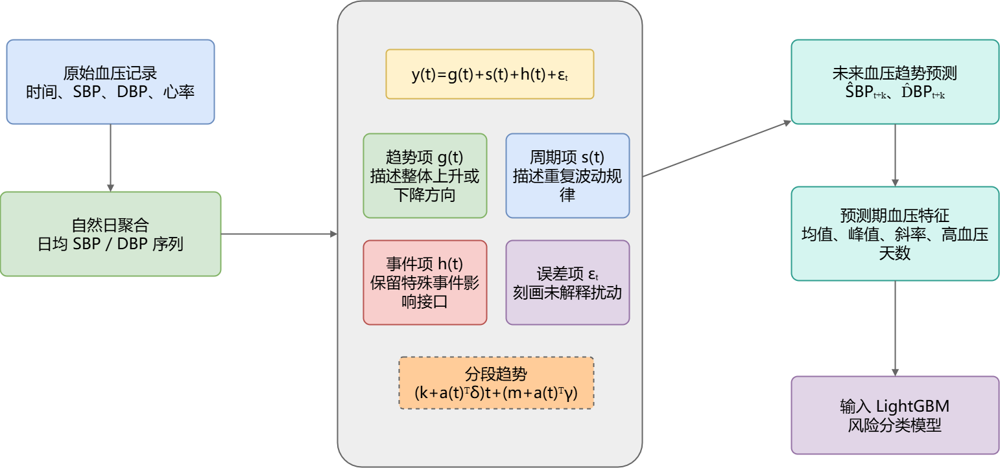
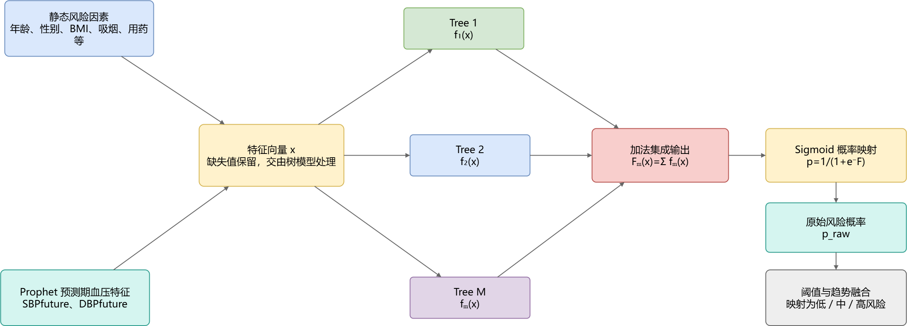
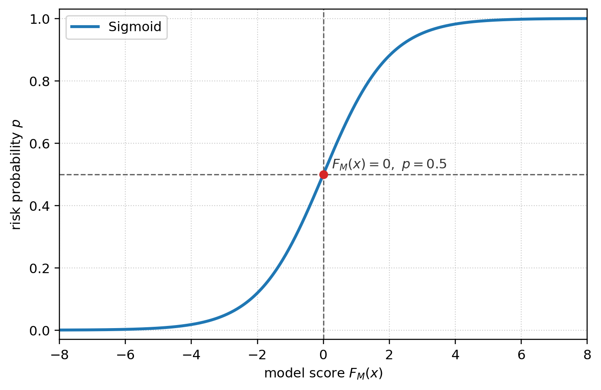
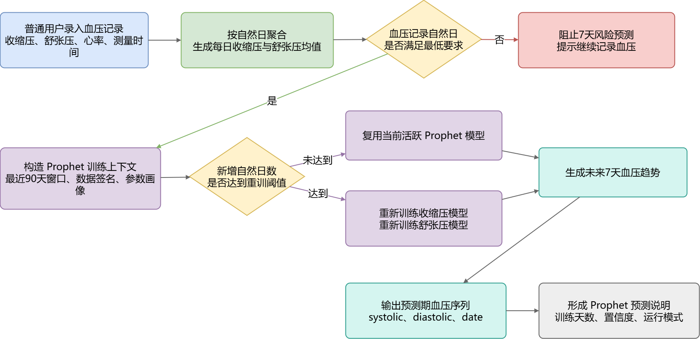
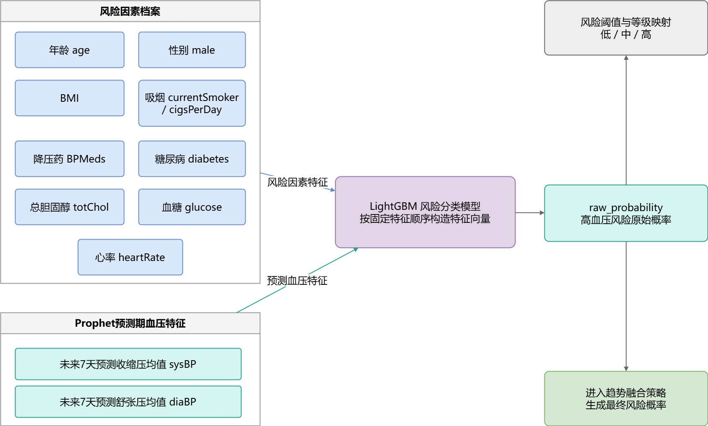
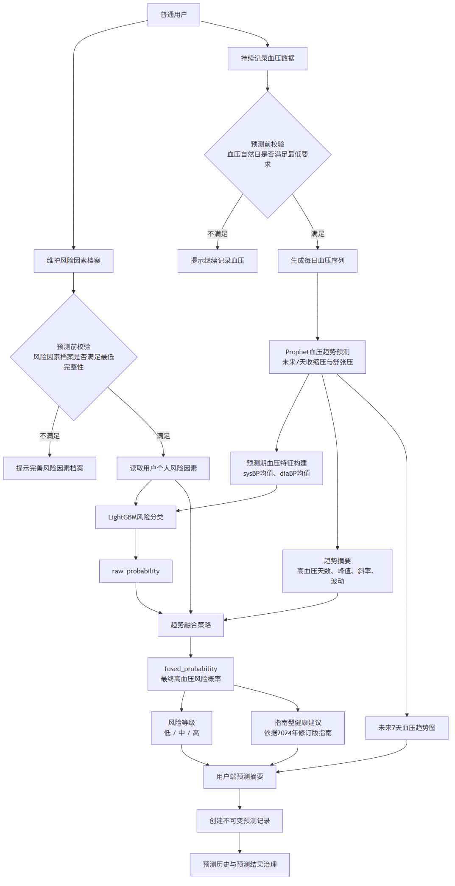
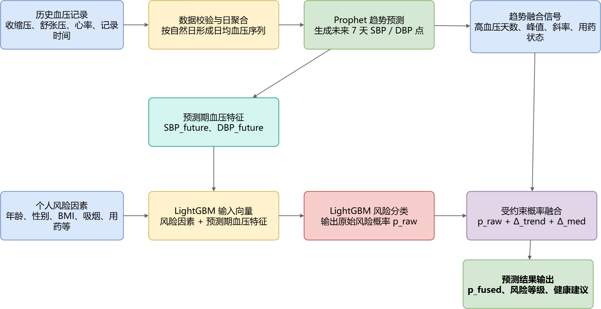
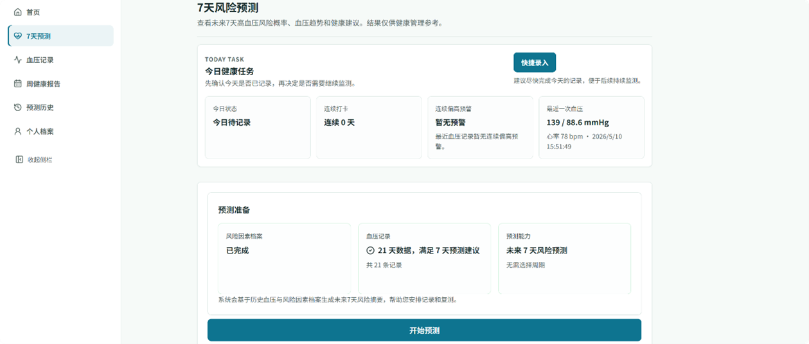
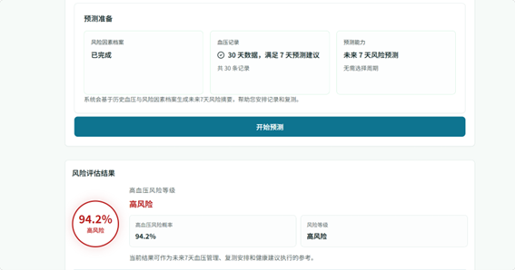

# 基于Prophet与LightGBM的高血压风险预测系统设计与实现

## 摘要

高血压是开展慢性病管理的高频问题，家庭血压计以及健康平台持续沉淀了大量的个人测量记录，许多记录仍然主要去服务于数据的保存以及查询。近期血压走向、短期风险提醒以及预测依据解释没有真正进入日常使用当中，普通用户虽然可以看到一串数值，却未必能判断收缩压以及舒张压的波动是不是已经需要关注了。

本文设计并且得以实现了基于Prophet以及LightGBM来开展的高血压风险预测辅助系统。会把用户血压数据按自然日整理为日均序列，Prophet生成未来7天的收缩压以及舒张压趋势。预测期血压均值等特征跟年龄、BMI、吸烟、用药以及糖尿病等风险因素合并后输入LightGBM当中，系统便会给出高血压风险概率以及等级。

实验结果表明，进行参数调整的LightGBM在公开健康检查数据集上有着较好的分类表现，血压特征在开展模型判断时占了主要权重。Prophet回测以及趋势融合的结果显示，能够把短期血压走势转化为风险分类的输入，并且在原始概率基础上形成幅度受限、缘由可追溯的修正。本文方法可为短期的健康管理提供参考，但不适宜去替代临床诊断以及治疗决策。

**关键词**：高血压风险预测；Prophet；LightGBM；时间序列预测；健康管理系统

## Abstract

Hypertension frequently acts as a common issue in chronic disease management. Home blood pressure monitors, alongside health platforms, keep accumulating personal measurement records. Many records still primarily serve basic storage and querying needs. Meanwhile, recent blood pressure trends, short-term risk reminders, along with prediction result explanations, have not really entered daily use. Thus, ordinary users might see a series of values, yet still find it quite hard to properly judge if systolic and diastolic blood pressure fluctuations actually require attention.

This paper designs and implements a hypertension risk prediction assistance system based on Prophet and LightGBM. User blood pressure data are organized into daily average sequences by natural day, Prophet generates the seven-day trends of systolic and diastolic blood pressure, and features such as predicted blood pressure averages are combined with risk factors including age, BMI, smoking, medication use, and diabetes before being fed into LightGBM, which outputs the hypertension risk probability and risk level.

Experimental results indicate the parameter-tuned LightGBM model manages to achieve good classification performance within a public health-check dataset, where blood pressure features actually carry the main weight during model decisions. Furthermore, Prophet back-testing alongside trend-fusion results demonstrate short-term blood pressure trends can easily be converted into risk classification inputs, forming bounded, traceable adjustments upon the original probability. Consequently, the proposed method is quite suitable for short-term health management reference, rather than substituting actual clinical diagnosis or treatment decisions.

**Key words**: hypertension risk prediction; Prophet; LightGBM; time series forecasting; health management system

## 第1章 绪论

### 1.1 研究背景及意义

高血压长期处在我国慢性病防控以及心血管健康管理的核心位置。血压持续偏高会把心脑血管事件的发生概率推高，同时还会去改变居民日常的测量、用药以及就医决策。由于疾病早期往往缺少明显的不适，许多用户只有在去进行体检、复诊或者偶然测量时才会意识到血压出现了异常。这个管理的过程很容易受到记录不连续、风险感知不足以及干预时机滞后等方面的影响。中国高血压防治指南2024年修订版对血压分级、生活方式干预以及健康管理给出了系统的建议[1]。中国高血压健康管理规范2019以及国家基层高血压防治管理指南2020版把连续监测、风险评估以及规范随访列为了基层管理的重要内容[2][3]。同时，中国心血管健康以及疾病报告2023概要也提示，心血管疾病防控的压力仍然存在，高血压的管理质量会去影响居民长期的健康水平[4]。

家庭血压计、可穿戴设备以及互联网健康平台进入到日常生活之后，普通用户开展血压记录工作的门槛有了明显降低。跟门诊当中的单次测量相比较，连续的记录能够更容易地暴露一段时间内的变化方向、波动幅度以及异常的升高。早晚的测量差异、短期的反复偏高、服药之后仍然未得到控制等现象也可以在记录当中留下痕迹。相关规范所提出的连续监测以及风险评估要求可以更容易地落到个人的管理场景当中[2][3]。在现实的使用当中，不少系统仍然主要拥有保存、查询以及统计的功能。虽然历史数据被完整地留下来了，但近期血压是不是正在抬升、未来几天是不是需要去加强观察，往往还会需要用户自己去进行判断。

现有的健康管理系统通常把用户档案、血压记录以及后台维护当作主要功能来使用。虽然基础的数据管理工作可以完成，但是数据当中隐藏的风险信号却并没有被充分地提取出来。已有的研究认为，高血压风险的判断需要同时纳入人口学特征、生活方式、血压指标以及代谢指标等变量[5]。年龄、BMI、吸烟、用药以及糖尿病等相对稳定的因素会去影响风险，近期的收缩压以及舒张压的变化方向同样也会改变判断的结果。如果只去依赖静态的档案或者是最近一次的测量值，连续记录当中的趋势信息就很容易丢失。要是只给出趋势曲线，普通用户又未必能把曲线变化理解为一种风险提醒。这样，系统也很难去说明风险概率升高的缘由主要囊括哪些、哪些血压变化参与了判断，以及用户下一步应当把注意力放在复测、生活方式还是就医咨询方面。那么，血压趋势预测以及结构化风险分类之间便需要进行更清晰的模型衔接。

本文运用Prophet以及LightGBM来开展高血压风险预测辅助系统的构建工作。用户的连续血压记录按自然日整理之后便会进入到趋势预测的流程当中。未来7天的血压变化不会再仅仅停留为历史数据的外推曲线，而是会被提取为可以进入分类模型当中的血压特征。系统结合个人的风险因素来输出高血压风险的概率以及等级。这个设计会把零散的记录、短期的趋势以及风险的判断放入到同一条计算流程当中，从而让用户可以更早地去注意异常的变化，并且凭借此来调整记录习惯、复测频率以及健康管理行为。同时这也让健康平台从单纯的数据留存工具进一步转向了可解释的辅助提醒工具。

本文会把研究重点放在模型的衔接以及结果解释方面。Prophet从个人的血压序列当中去提取预测期的血压特征。LightGBM会把这些特征以及结构化的风险因素共同用于开展分类工作。两类模型串联之后，可以同时去借助时间序列信息以及个人档案信息。风险概率、血压趋势、置信度说明以及指南型建议共同组成了结果解释，单独的模型分数在这些信息的配合之下能够更容易地被理解。从系统实现的角来看，这个思路也有利于把时间序列预测、表格分类、结果展示以及健康建议组织成一个较完整的工程闭环，从而为后续接入更多的风险因素、去进行阈值策略的优化以及开展人群的外部验证留下扩展空间。系统被定位为健康管理辅助工具，它的预测结果只会提示近期的血压变化以及相关的风险因素，并不能去替代临床的诊断、处方或者治疗的决策。

### 1.2 国内外研究现状

#### 1.2.1 国内研究现状

国内高血压风险预测研究已从经验判断逐步转向去开展数据建模工作，相关综述认为，高血压风险评估需把人口学特征、生活方式、血压以及代谢指标等变量纳入其中[5]，单次血压测量值或单一生活习惯变量很难去完整反映个体的状态，钢铁工人高血压风险预测模型研究比较了多种机器学习模型，并且运用AUC、F1、BrierScore等指标来评价模型表现[6]，同时冠心病风险预测模型构建研究也显示，能把机器学习用于心血管疾病风险的识别工作，类别不平衡的处理、模型选用以及多指标评价都会去影响结论可信度[8]。

国内慢性病预测研究还把体检指标、基层健康评估和时间序列方法纳入建模讨论，体检人群糖尿病风险预测研究说明，常规体检指标可以构建风险评估模型⁹，SARIMA 与 Prophet 混合算法研究说明 Prophet 在时间序列预测任务中有较好的工程适配性¹¹，基层医生高血压健康评估相关研究提示，风险评估结果需要转化为用户能够理解并执行的管理建议¹²，这些成果为本文使用用户风险因素档案、血压相关指标和短期趋势预测提供了参照，现有研究对连续血压记录中的时间变化利用仍不充分，可解释机器学习研究表明，特征重要性和模型解释可以提高疾病预测结果的可理解性¹⁰，静态特征解释却很难回答近期血压变化带来的疑问。

#### 1.2.2 国外研究现状

国外研究较早关注基于易采集风险因素的高血压预测，相关研究表明，年龄、体重、生活方式等普通用户能够提供的变量可以用于机器学习建模⁷，这类方法降低了数据采集门槛，也更接近健康平台和基础筛查场景中的实际数据条件，对于面向普通用户的风险预测系统具有较强参考价值。

Prophet原始论文提出了面向大规模预测任务的加性时间序列模型，可以借助趋势项、季节项以及事件项来进行序列变化的描述[14]。LightGBM原始论文提出了高效的梯度提升决策树框架，依靠直方图算法以及叶子优先生长策略来提升结构化数据的建模效率[15]。前者适宜去处理时间序列趋势方面的工作，后者则适宜去处理表格特征，这个正好契合了本文所要连接的两个环节。

国外健康管理系统的研究也更加重视结果的呈现以及用户的理解。高血压可视化风险预测系统研究显示，把机器学习风险预测以及可视化界面进行结合之后，用户能够更容易地去理解风险结果以及相关的影响因素[13]。模型的输出不能仅仅停留在概率或者类别标签的层面，还需要把影响因素、趋势变化以及健康建议一并呈现出来，这样才可以真正去服务于现实的健康管理场景。

#### 1.2.3 本论文研究切入点

国内外研究已经说明了静态风险因素、表格分类模型、时间序列预测以及可视化解释各自具备可行性。本文回到了普通用户连续血压记录的这个应用场景当中，更加去关注这些方法在高血压风险预测系统里的衔接方式，也就是家庭血压记录怎样从历史数据变成短期趋势，短期趋势怎样进入到风险分类模型，同时模型结果又怎样转化为用户能够理解的风险概率、等级以及建议。

本文系统运用Prophet去处理个人血压时间序列，并且借助LightGBM来完成结构化风险分类工作。用户血压记录按自然日聚合之后会生成未来7天的趋势特征，然后再把它们跟年龄、BMI、吸烟、用药以及糖尿病等风险因素共同放入分类流程当中。趋势融合模块会在原始概率的基础上来进行幅度受限、缘由可追溯的修正。研究重点由开展单一模型性能比较转向了双模型流程的设计、预测期特征的衔接以及结果解释，从而使得系统更契合短期健康管理当中的实际使用需求。

### 1.3 研究方法与内容

本文围绕Prophet血压趋势预测、LightGBM风险分类以及趋势融合来开展研究并且得以实现。文献分析被用于去梳理高血压风险预测、时间序列预测以及机器学习分类的基础，模型的设计用于去明确Prophet以及LightGBM的输入输出关系。特征构建方面说明了预测期的血压特征是如何进入到风险分类模型当中的，实验评估检验了LightGBM的分类效果以及Prophet的预测误差，场景分析则去观察了趋势融合对不同血压变化情况所产生的影响。以下便是本文的主要工作。

本文开展了双模型预测流程的构建工作。用户的历史血压记录会按自然日被聚合为每日的血压序列，Prophet会去预测未来7天的收缩压以及舒张压。预测期的血压均值会进入到LightGBM风险分类输入当中，从而使得模型既能去运用静态的风险因素，同时也能去纳入短期的血压趋势。

在预测期特征衔接以及趋势融合方面，本文把风险因素以及历史血压记录当作输入来使用，由Prophet去生成未来7天的收缩压以及舒张压趋势。然后再去提取预测期均值等血压特征，让其进入到LightGBM分类模型当中，趋势信号则用于对原始的风险概率来进行受约束的修正工作。

模型训练以及实验分析选用公开数据文件Hypertension-risk-model-main.csv当中的4240条样本来完成。LightGBM的结果借助Accuracy、AUC、Precision、Recall、F1、PR-AUC、BrierScore以及混淆矩阵来进行评价。特征重要性分析则被用于去说明血压预测特征在风险分类当中的贡献。

趋势融合以及模型结果分析基于Prophet预测结果来开展，去构造高血压天数、血压峰值、趋势方向以及用药未控制等信号。LightGBM的原始概率会在这些信号的作用之下进行受约束的修正，典型的场景分析被用于去说明修正幅度以及触发的具体缘由。

## 第2章 相关理论介绍

### 2.1 时间序列预测

时间序列预测借助时间排列的历史观测值去估计后续变化，血压记录中测量时间、收缩压、舒张压以及心率并非孤立字段，把它按日期整理会形成连续序列，近期血压水平、波动幅度以及变化方向都会去影响未来短期风险判断，这与普通表格分类特征不同。

从数学形式看，若用户共有 $T$ 个按时间排序的血压观测点，可以将其表示为一个时间序列：

|  |  |
|:---:|---:|
| $\displaystyle \mathbf{Y}_{1:T}=\{y_1,y_2,\ldots,y_T\},\quad y_t=(SBP_t,DBP_t,HR_t)$ | (1) |

式中，$\mathbf{Y}_{1:T}$ 表示从第 1 个观测点到第 $T$ 个观测点组成的血压时间序列，$y_t$ 表示第 $t$ 次记录中的观测向量，$SBP_t$、$DBP_t$ 和 $HR_t$ 分别表示该次记录中的收缩压、舒张压和心率。建模时保留记录顺序，近期记录对未来判断通常更有参考价值，打乱时间顺序会削弱这种信息。

时间序列预测的目标，是根据最近一段历史观测值估计未来第 $h$ 个时间点的取值，可抽象表示为：

|  |  |
|:---:|---:|
| $\displaystyle \widehat{y}_{T+h}=f(y_T,y_{T-1},\ldots,y_{T-p+1}),\quad h=1,2,\ldots,H$ | (2) |

式中，$\widehat{y}_{T+h}$ 表示未来第 $h$ 个时间点的预测值，$p$ 表示模型使用的历史窗口长度，$H$ 表示预测步长。本文将 $H$ 取为 7，用用户近期血压记录估计未来 7 天收缩压和舒张压变化，目的不是判断长期疾病结局，而是给后续风险分类提供更贴近当前状态的血压特征。

实际血压序列通常不会完全平稳，长期升降趋势以及短期重复波动、测量误差会同时存在，为方便开展后续说明，可把单变量时间序列去简化分解为：

|  |  |
|:---:|---:|
| $\displaystyle y_t=\tau_t+s_t+r_t$ | (3) |

式中，$\tau_t$ 表示趋势项，用于描述整体上升或下降方向，$s_t$ 表示周期项或重复波动，$r_t$ 表示随机扰动和模型尚未解释的部分。健康管理场景下，用户测量时间不一定固定，记录频率也可能不均衡，建模前需要先做聚合与清洗，本文将同一自然日内的一条或多条血压记录整理为日均收缩压和日均舒张压，使 Prophet 输入序列更稳定。

时间序列预测在本文系统中的基本处理流程如图2-1所示，把原始血压记录按时间排序后放入自然日聚合环节，Prophet去生成未来7天血压趋势，预测期均值等结果再转换为LightGBM所需血压特征。

本文的时间序列预测任务并非去预测长期疾病结局，而是依据用户近期血压记录去生成未来7天的血压趋势。预测结果本身不会直接构成高血压风险结论，而是被转换为LightGBM预测期血压特征。这样能避免运用最近一次血压值开展静态分类，并且让系统展示未来血压走势，来增强结果的解释性。
### 2.2 Prophet模型

Prophet是面向时间序列预测的加性模型，适宜去处理具趋势、周期以及异常波动的数据。它基本思想是把时间序列拆分成趋势、周期、事件影响以及随机误差等可解释成分。基本形式能表示为：

|  |  |
|:---:|---:|
| $\displaystyle y(t)=g(t)+s(t)+h(t)+\epsilon_t$ | (4) |

其中，$g(t)$ 表示趋势项，用于描述时间序列整体变化方向；$s(t)$ 表示季节性或周期项；$h(t)$ 表示节假日或特殊事件项；$\epsilon_t$ 表示误差项[14]。对于存在突变点的序列，Prophet 可用分段趋势表达不同阶段的变化速度，线性趋势项可抽象为：

|  |  |
|:---:|---:|
| $\displaystyle g(t)=(k+a(t)^{T}\delta)t+(m+a(t)^{T}\gamma)$ | (5) |

式中，$k$ 为基础增长率，$m$ 为偏置项，$a(t)$ 表示时间 $t$ 是否经过候选变化点的指示向量，$\delta$ 表示变化点前后趋势斜率调整量，$\gamma$ 用于保证趋势函数在变化点处连续。本文场景关注个人近期血压变化，Prophet 主要承担趋势建模任务，它的输出不被解释为临床结论。

图2-2给出了Prophet在本文的计算位置，先把原始血压记录聚合为每日收缩压以及舒张压序列，再进入Prophet加性模型，趋势项、周期项、事件项以及误差项共同去描述序列变化，来输出未来血压趋势。系统不会把该趋势直接当作高血压结论，而是去提取预测期均值、峰值、斜率以及高血压天数等特征，供LightGBM风险分类去选用。

Prophet的结构较清楚，输出同时包含未来时间点以及预测值，便于去形成血压趋势曲线。相比直接运用最近一次血压值，Prophet能够根据一段记录去生成未来7天连续趋势，预测期血压均值、高血压天数、峰值以及斜率也会随之得到。普通用户更容易理解短期曲线，LightGBM则会把未来7天预测均值当作结构化输入特征，去参与风险概率的计算。

用户发起预测时，系统基于血压历史记录来开展Prophet模型训练或复用。为兼顾预测效果以及交互效率，默认最多选用近90天日均血压数据。要是新增自然日达到阈值就重新开展训练，未达到那就复用已有模型并且去生成新结果。模型资产表仅保存版本、数据签名、训练截止日期以及存储键等信息，训练天数、置信度等级、参数画像以及运行模式随单次记录保存，去解释本次预测。

### 2.3 LightGBM模型

LightGBM 属于梯度提升决策树方法，适合处理用户档案、体检指标和预测期血压均值这类结构化表格特征，模型训练时把多棵决策树按轮次叠加，每一棵树补偿前一轮损失方向上的误差，多个弱学习器累加后形成最终判别函数，第 $M$ 轮后的加法模型可表示为：

|  |  |
|:---:|---:|
| $\displaystyle F_M(x)=\sum_{m=1}^{M} f_m(x)$ | (6) |

式中，$x$ 为输入特征，$f_m$ 为第 $m$ 棵决策树，$M$ 为树的数量，LightGBM 在每轮训练中同时考虑样本损失和模型复杂度，目标函数可写为：

|  |  |
|:---:|---:|
| $\displaystyle \mathcal{L}^{(m)}=\sum_{i=1}^{N}l(y_i,\hat{y}^{(m-1)}_i+f_m(x_i))+\Omega(f_m)$ | (7) |

式中，$l$ 为样本损失函数，$\Omega$ 为树模型复杂度惩罚项，经过二阶泰勒展开后，叶子节点的最优权重由该叶子内样本的一阶梯度和二阶梯度共同决定，可表示为：

|  |  |
|:---:|---:|
| $\displaystyle w_j^{*}=-\frac{G_j}{H_j+\lambda}$ | (8) |

其中，$G_j$ 和 $H_j$ 分别表示第 $j$ 个叶子节点上一阶梯度和二阶梯度之和，$\lambda$ 为正则化系数，系数取值越大，叶子权重受到的约束越强，模型对训练样本细节的追随程度会被压低。

图 2-3 对应本文风险分类中的计算流程，输入信息包含年龄、性别、BMI、吸烟、用药和代谢指标等静态风险因素，也包含 Prophet 生成的预测期血压特征，LightGBM 通过多棵决策树拟合风险判别函数，各树结果累加得到模型分数，再由 Sigmoid 函数映射为原始风险概率，阈值判断和趋势融合都沿用这一概率。

在二分类任务中，模型分数需要转换为正类概率，本文采用 Sigmoid 变换完成映射：

|  |  |
|:---:|---:|
| $\displaystyle p=P(y=1\mid x)=\frac{1}{1+e^{-F_M(x)}}$ | (9) |

图2-4展示Sigmoid函数概率映射关系，要是模型分数较小，输出概率就靠近低风险区间，分数升高后风险概率会随之增加，LightGBM给出的并非单纯类别标签，而是能去用于阈值搜索、风险分级以及趋势融合的概率值。

本文将高血压风险预测处理为二分类概率输出任务，LightGBM 生成高血压风险概率，系统再把概率映射为低风险、中风险和高风险等级。

LightGBM与普通GBDT相比会有更高的训练效率，对较多特征以及样本有较好适应性，直方图算法、叶子优先生长策略、特征采样以及数据采样是常见优化机制[15]，健康风险预测当中的年龄、BMI、吸烟情况、糖尿病、胆固醇、血糖以及预测期血压均值大多属结构化特征，适宜运用LightGBM去建模。调参时重点调整叶子数、特征采样比例、样本采样比例、正则化系数以及最小叶子样本数，去控制树模型复杂度并且改善查全率以及F1表现。

LightGBM输入含12个核心特征，性别、年龄、吸烟状态、日吸烟支数、降压药选用情况、糖尿病、总胆固醇、预测期收缩压均值、预测期舒张压均值、BMI、心率以及血糖皆在其中，收缩压以及舒张压来自Prophet对未来7天的趋势预测，其他字段源自用户维护的风险因素档案，LightGBM原始概率会再进入趋势融合策略，来形成最终展示的风险概率。

### 2.4 本章小结

本章围绕时间序列预测、Prophet以及LightGBM去展开理论说明，时间序列预测为血压趋势建模去提供方法基础，Prophet从历史血压记录中生成未来7天收缩压以及舒张压预测，LightGBM接收预测期血压特征以及个人风险因素并且去输出高血压风险概率，两个模型在系统按先后环节开展串联，前者去提供短期血压特征，后者完成风险分类，这关系把后续实验的数据处理、特征构建以及风险判断流程连在一起。

## 第3章 实验数据集与评价指标

### 3.1 实验数据集介绍

本文没有自行采集受试者原始数据，实验使用和鲸社区公开数据集页面下载的健康检查数据文件 `Hypertension-risk-model-main.csv`，页面地址为 `https://www.heywhale.com/mw/dataset/6736f8d20bb59b78302c1397`。该文件包含 4240 条样本，字段覆盖年龄、性别、吸烟情况、降压药使用情况、糖尿病、总胆固醇、收缩压、舒张压、BMI、心率和血糖等信息。本文关注高血压风险辅助预测，训练前将原始数据中表示既往高血压状态的字段 `prevalentHyp` 整理为 `Risk` 标签，整理后正样本 1317 条，负样本 2923 条，正样本比例为 31.1%，后续实验均基于这份训练数据完成。

数据集字段如表 3-1 所示。

**表3-1 LightGBM 训练特征说明**

| 字段 | 含义 | 来源 |
| --- | --- | --- |
| male | 性别二值特征 | 风险因素档案或训练数据 |
| age | 年龄 | 风险因素档案或训练数据 |
| currentSmoker | 是否当前吸烟 | 风险因素档案或训练数据 |
| cigsPerDay | 日吸烟支数 | 风险因素档案或训练数据 |
| BPMeds | 是否服用降压药 | 风险因素档案或训练数据 |
| diabetes | 是否糖尿病 | 风险因素档案或训练数据 |
| totChol | 总胆固醇 | 风险因素档案或训练数据 |
| sysBP | 收缩压 | 训练数据或 Prophet 预测期均值 |
| diaBP | 舒张压 | 训练数据或 Prophet 预测期均值 |
| BMI | 体质指数 | 由身高体重或数据字段得到 |
| heartRate | 心率 | 血压记录或训练数据 |
| glucose | 血糖 | 风险因素档案或训练数据 |

在真实系统进行预测时，sysBP以及diaBP不会直接运用用户最近一次的测量值，而是选用Prophet预测所得到的未来7天收缩压均值以及舒张压均值。这样做能够把短期血压趋势信息纳入到LightGBM风险分类模型当中。其他风险因素则来源于用户在系统中所维护的风险因素档案。系统不会把盐摄入量以及睡眠时长写入当前的模型输入里，这些字段仅仅作为后续的扩展方向。

训练数据存在少量缺失，根据本次重新训练生成的模型报告，`cigsPerDay` 缺失 29 条，`totChol` 缺失 50 条，`BMI` 缺失 19 条，`heartRate` 缺失 1 条，`glucose` 缺失 388 条。本文采用 LightGBM 原生缺失值处理策略，在保留缺失信息的情况下完成训练，预测中的可缺失字段也不强制填补，而是交由 LightGBM 的缺失值分裂机制处理。

### 3.2 数据预处理与特征构建

数据预处理基于字段标准化、缺失值处理、训练测试划分、阈值验证集划分以及预测期血压特征构建来开展，训练阶段主要选用基础训练集，并把系统导出的训练样本当作补充来源，当前模型报告中系统导出样本数为0，实验结果主要来源于基础训练集。

模型训练时，数据集被划分为训练集、测试集、阈值验证集和 early-stop 验证集，训练集样本数为 3392，测试集样本数为 848，阈值验证集样本数为 340，early-stop 训练样本数为 2746，early-stop 验证样本数为 306，最终重训样本数为 3052，训练脚本先在 early-stop 验证集上确定最佳迭代轮数，再使用完整训练池重训最终模型，分类阈值在独立阈值集上搜索。

用户发起实时预测时，原始血压记录先按自然日聚合，同一天存在多条记录时，该日收缩压和舒张压分别取均值：

|  |  |
|:---:|---:|
| $\displaystyle \overline{SBP}_d=\frac{1}{n_d}\sum_{i=1}^{n_d}SBP_{d,i}$ | (10) |

|  |  |
|:---:|---:|
| $\displaystyle \overline{DBP}_d=\frac{1}{n_d}\sum_{i=1}^{n_d}DBP_{d,i}$ | (11) |

式中，$n_d$ 表示第 $d$ 天的血压记录数量，$SBP_{d,i}$ 和 $DBP_{d,i}$ 分别表示第 $d$ 天第 $i$ 条记录中的收缩压和舒张压，聚合后的每日血压序列进入 Prophet 训练流程。

Prophet 输出未来 7 天收缩压和舒张压预测值后，系统继续构造预测期血压特征：

|  |  |
|:---:|---:|
| $\displaystyle SBP_{future}=\frac{1}{7}\sum_{k=1}^{7}\widehat{SBP}_{t+k}$ | (12) |

|  |  |
|:---:|---:|
| $\displaystyle DBP_{future}=\frac{1}{7}\sum_{k=1}^{7}\widehat{DBP}_{t+k}$ | (13) |

式中，$\widehat{SBP}_{t+k}$ 和 $\widehat{DBP}_{t+k}$ 表示 Prophet 对未来第 $k$ 天收缩压和舒张压的预测值，构造后的 $SBP_{future}$ 和 $DBP_{future}$ 分别映射到 LightGBM 的 sysBP 和 diaBP 特征。

### 3.3 模型评价指标

模型评价指标应当与任务目标相契合，本文所运用到的LightGBM模型不仅会输出高风险或者非高风险的二分类结果，还要提供出可供展示的风险概率。在进行评价时，不能仅仅去看总体的正确率，当正负样本的分布并没有完全均衡的时候，单独使用Accuracy会极大程度地掩盖掉正类样本被漏判的问题。

结合医学风险分类和机器学习分类实验中的常用评价方式，本文使用 Accuracy、Precision、Recall、F1、AUC、PR-AUC、Brier Score 和混淆矩阵评价模型，Accuracy 反映总体预测正确比例，Precision 反映模型提示为高风险时的可信程度，Recall 反映真实高风险样本被识别出来的比例，F1 用于观察 Precision 与 Recall 的平衡关系，AUC 和 PR-AUC 用于评价不同阈值下的排序区分能力，Brier Score 用于观察概率输出是否适合风险展示，混淆矩阵直接呈现 TP、TN、FP 和 FN 的数量关系，设 TP 表示正类预测正确数量，TN 表示负类预测正确数量，FP 表示负类被误判为正类数量，FN 表示正类被误判为负类数量，则 Accuracy 表示总体预测正确比例：

|  |  |
|:---:|---:|
| $\displaystyle Accuracy=\frac{TP+TN}{TP+TN+FP+FN}$ | (14) |

Precision 表示预测为正类的样本中真实正类比例：

|  |  |
|:---:|---:|
| $\displaystyle Precision=\frac{TP}{TP+FP}$ | (15) |

Recall 表示真实正类样本被模型识别出的比例：

|  |  |
|:---:|---:|
| $\displaystyle Recall=\frac{TP}{TP+FN}$ | (16) |

F1 值是 Precision 与 Recall 的调和平均：

|  |  |
|:---:|---:|
| $\displaystyle F1=\frac{2\times Precision\times Recall}{Precision+Recall}$ | (17) |

AUC 衡量模型在不同分类阈值下对正负样本的区分能力，不直接受某一个固定分类阈值影响，本文关注正类样本识别，PR-AUC 可补充观察正类识别效果，系统前端需要展示风险概率，Brier Score 用于衡量概率预测与真实标签之间的均方误差，数值越小，概率输出越接近真实标签：

|  |  |
|:---:|---:|
| $\displaystyle Brier=\frac{1}{N}\sum_{i=1}^{N}(p_i-y_i)^2$ | (18) |

式中，$p_i$ 表示第 $i$ 个样本的预测概率，$y_i$ 表示真实标签，本文保留这些指标，并不是为了堆叠评价项，而是从区分能力、漏判控制、提示可信度和概率可用性几个角度检查模型结果，使后续实验分析能对应系统实际用途。

### 3.4 本章小结

本章说明 LightGBM 训练数据集、主要特征、缺失值情况、数据划分方式和模型评价指标，本文的关键特征构建在于把 Prophet 未来 7 天血压预测结果转化为 LightGBM 输入特征，由此连接时间序列预测和结构化风险分类，下一章进入双模型算法设计。

## 第4章 双模型预测算法设计

### 4.1 Prophet血压趋势预测方法

Prophet模型主要被运用于预测普通用户的未来7天血压趋势。在用户录入收缩压、舒张压、心率以及记录时间以后，系统会把这些数据按自然日进行聚合，进而形成每日的收缩压均值以及舒张压均值序列。在预测之前，系统会去检查血压记录所覆盖的自然日数量，要是数据量不足，就不会去创建预测记录，以此来避免在序列过短的时候输出不稳定的结果。

如图4-1所示的Prophet血压趋势预测流程，系统在读取血压记录并完成自然日聚合工作以后，会去构造训练上下文，进而去判断是进行模型复用还是重新训练。随后，系统会生成未来7天的预测结果以及预测说明。系统默认最多选用近期90天的日均血压数据来参与Prophet的训练，因为过长的历史数据有可能会稀释掉近期的趋势，同时也会增加系统的响应时间。Prophet所输出的预测点会先被转换为预测期血压特征：

|  |  |
|:---:|---:|
| $\displaystyle X_{bp}^{future}=\left[\frac{1}{7}\sum_{k=1}^{7}\widehat{SBP}_{t+k},\frac{1}{7}\sum_{k=1}^{7}\widehat{DBP}_{t+k}\right]$ | (19) |

式中，$X_{bp}^{future}$ 表示 LightGBM 所需的未来 7 天血压特征，$\widehat{SBP}_{t+k}$ 与 $\widehat{DBP}_{t+k}$ 分别表示 Prophet 对未来第 $k$ 天收缩压和舒张压的预测值，经过该处理，输入 LightGBM 的血压变量不再是单次测量值，而是带有短期趋势信息的预测期均值。

由于不同用户的记录长度以及波动情况会有极大的差异，系统会据此去生成short、standard以及volatile这三类参数画像。在记录较少的时候，会选用更为保守的参数设置；当血压波动比较大的时候，则会在预测说明当中保留置信度的原因。Prophet的输出内容不仅仅包含未来的7天预测点，还拥有训练数据天数、历史窗口是否截断、模型运行模式以及置信度等级，系统会把这些说明随单次预测记录保存下来，而不会去堆叠到模型资产表当中。

Prophet模型并不会在每次预测的时候都进行重新训练，而是采取了模型复用与增量重训的策略。当用户自上次训练以来所新增的血压自然日数量未达到阈值的时候，系统会复用已有的模型并重新生成预测结果；而在达到阈值的时候，则会进行重新训练。这里所复用的是模型资产，而非旧的预测结果。每次成功发起7天的风险预测以后，都会生成新的预测记录，同时历史结果依旧可以追踪。预测周期得以被固定为未来7天，模型缓存键以及文件存储路径不再包含可变的预测周期槽位。旧版按预测天数分层的模型资产，在清理以后可以通过下一次预测来重新生成。

### 4.2 LightGBM风险分类方法

LightGBM风险分类模块会去接收用户的个人风险因素以及Prophet预测期血压特征，进而输出高血压风险概率。用户需要在档案当中去维护好年龄、性别、身高、体重、吸烟情况、降压药使用情况、糖尿病、胆固醇以及血糖等相关信息。系统会根据身高和体重来计算出BMI，然后再把这个数值与Prophet所得到的未来7天收缩压均值、舒张压均值合并在一起，当作模型输入来使用。

在图4-2当中，LightGBM的输入特征来源于用户风险因素以及预测期血压特征，像年龄、性别、BMI、吸烟、用药、糖尿病、总胆固醇以及血糖等都属于相对稳定的信息，而Prophet对未来7天收缩压和舒张压预测值的均值，则反映出了近期的血压变化。为了方便后续公式的书写，我们把这些字段合并记为LightGBM的输入向量，并且用表示模型所输出的原始风险概率：

|  |  |
|:---:|---:|
| $\displaystyle \begin{aligned} \mathbf{x}_{LGBM}=&(male,age,smoker,cigsPerDay,BPMeds,diabetes,\\ &totChol,SBP_{future},DBP_{future},BMI,heartRate,glucose),\\ p_{raw}=&F_{LGBM}(\mathbf{x}_{LGBM}) \end{aligned}$ | (20) |

式中，$\mathbf{x}_{LGBM}$ 表示输入 LightGBM 的特征向量，$F_{LGBM}$ 表示训练完成的 LightGBM 分类器，$p_{raw}$ 表示未经过趋势融合的高血压风险概率，系统再结合趋势方向、高血压天数、趋势斜率、波动程度和用药信号进行工程融合，得到最终风险概率。

风险概率会被映射为低风险、中风险以及高风险这三个层级，以此来帮助普通用户理解风险的大小，但这些结果并不作为临床分级的结论来使用。对于可缺失的模型输入字段，系统不会进行强行的填补，而是会保留其缺失的状态，并将其交由LightGBM原生的缺失值策略来进行处理。

### 4.3 双模型特征衔接与趋势融合

本文系统的核心所在，并非单一模型的预测，而是由Prophet与LightGBM串联所构成的双模型算法流程。Prophet会从用户的历史血压记录当中去提取未来7天的血压趋势，而LightGBM则会把预测期的血压特征与用户的风险因素结合起来，共同输出高血压的风险概率。

在图4-3当中，一次预测是从风险因素以及血压记录的录入开始的。系统会去校验档案的最低完整性以及血压记录的自然日数量，Prophet基于每日的血压序列去生成未来7天的收缩压以及舒张压预测，之后把预测期的血压均值写入LightGBM的输入特征里。在LightGBM输出原始风险概率以后，风险融合模块会依据趋势信号以及用药信号来对概率进行调整。建议模块则会依据风险等级、血压分级、趋势方向、预测期的高血压天数以及置信度，去生成指南型的健康建议，最终把预测记录保存下来。

两个模型之间的计算关系整理为图 4-4。

图4-4呈现出了本文的核心设计。Prophet的输出并不是最终的风险结论，而是LightGBM的动态血压输入；LightGBM的输出也并非临床诊断的结果，而是作为健康管理参考用的原始风险概率。趋势融合模块被放置在两个模型输出的后面，它会综合考虑高血压天数、峰值、斜率以及用药状态等信号，仅仅在概率层面做受约束的小幅度修正，从而使最终的结果能够与近期的血压走势保持一致。

融合前，系统从 Prophet 未来 7 天预测点中提取高血压天数比例和趋势斜率等信号：

|  |  |
|:---:|---:|
| $\displaystyle r_{high}=\frac{1}{7}\sum_{k=1}^{7}\mathbb{I}(\widehat{SBP}_{t+k}\ge140\ \text{or}\ \widehat{DBP}_{t+k}\ge90)$ | (21) |

|  |  |
|:---:|---:|
| $\displaystyle s_{SBP}=\widehat{SBP}_{t+7}-\widehat{SBP}_{t+1},\quad s_{DBP}=\widehat{DBP}_{t+7}-\widehat{DBP}_{t+1}$ | (22) |

式中，$r_{high}$ 表示预测期内达到高血压阈值的天数比例，$s_{SBP}$ 和 $s_{DBP}$ 分别表示 7 天预测期内收缩压和舒张压的首尾变化量，趋势融合调整项可概括为：

|  |  |
|:---:|---:|
| $\displaystyle \Delta_{trend}=\min(0.08,0.08r_{high})+0.02I_{peak}+0.02I_{up}-0.02I_{stable}$ | (23) |

式中，$I_{peak}$ 表示预测期是否出现收缩压不低于 150 mmHg 或舒张压不低于 95 mmHg 的峰值，$I_{up}$ 表示预测期是否存在明显上升趋势，$I_{stable}$ 表示是否为稳定低血压趋势，用户正在服用降压药但预测期仍出现高血压或峰值血压时，系统额外引入 $\Delta_{med}=0.02$ 的用药未控制修正项，最终融合概率为：

|  |  |
|:---:|---:|
| $\displaystyle p_{fused}=clip(p_{raw}+\Delta_{trend}+\Delta_{med},0.01,0.99)$ | (24) |

式中，$p_{raw}$ 表示 LightGBM 原始概率，$\Delta_{trend}$ 表示趋势相关调整量，$\Delta_{med}$ 表示用药相关调整量，clip 表示将概率限制在合理区间内，风险等级映射规则为：

|  |  |
|:---:|---:|
| $\displaystyle Level(p)= \begin{cases} 低风险,&p<0.30\\ 中风险,&0.30\le p<0.60\\ 高风险,&p\ge0.60 \end{cases}$ | (25) |

这些公式其实是工程融合策略的一种抽象化表达，主要用于解释模型的输出结果以及趋势信号应当如何进行合并，它并不代表临床风险模型。融合策略的边界仅仅在于小幅度的修正，并不会去替代掉LightGBM分类器，只是在模型原始概率的基础之上，加入了可供解释的血压趋势信号，从而使得最终的结果能够更加贴近用户近期的血压变化。

### 4.4 预测流程与页面展示

系统页面在本文当中，仅仅承担着预测入口以及结果呈现的工作任务，并不会去展开登录、后台管理、数据库结构以及普通数据维护页面的内容。用户侧的操作流程是从维护好必要的风险因素以及血压记录开始的，在进入7天风险预测页面以后去发起预测，系统会完成Prophet趋势预测、LightGBM风险分类以及趋势融合，结果页面会集中进行展示风险概率、风险等级、未来7天血压趋势以及健康建议。

7 天风险预测页用于展示预测前的数据准备状态和预测入口。

如图4-5所示，预测页面会突出显示出未来7天血压风险预测的入口，并且系统会依据用户的风险因素档案以及血压记录的状态，来给出相应的可执行提示。要是最低的数据条件不足，系统就不会直接去输出风险结果，而是会提示用户去完善风险因素或者补充血压记录，该页面实际上对应了双模型在进行预测之前的数据入口以及校验过程。

预测结果页用于呈现双模型计算后的输出。

如图4-6所示，预测结果当中囊括了高血压的风险概率、风险等级、未来7天的血压趋势图以及指南型的健康建议。血压趋势来源于Prophet的预测结果，风险概率则源自LightGBM的原始概率以及趋势融合以后的结果。该页面仅仅呈现出普通用户能够去理解的预测摘要，而不会去展开模型的输入快照、数据库字段或者后台治理信息。

### 4.5 本章小结

本章主要围绕着Prophet与LightGBM的双模型算法来开展论述，Prophet会从历史血压记录当中生成出未来7天的血压趋势，LightGBM则会把预测期的血压特征以及用户的风险因素结合起来，进而输出风险概率。趋势融合模块会在原始概率的基础之上，进行小幅度且具备可解释性的修正。本文将关注点放置在模型输入输出的关系、预测期特征的构建以及概率修正方法上，而系统页面仅仅是被用于承接预测入口以及展示预测结果，是服务于预测流程说明的，并不会将其当作主要的研究对象。

## 第5章 模型训练与实验结果分析

### 5.1 实验环境

本文系统采用前后端分离架构，模型训练和后端服务都在 Python 环境中完成，实验与开发环境见表 5-1。

**表5-1 实验与系统环境**

| 类别 | 配置 |
| --- | --- |
| 后端语言 | Python |
| 后端框架 | Flask、Flask-SQLAlchemy、Flask-Migrate |
| 前端框架 | React、TypeScript、React Router |
| 数据库 | MySQL 8 |
| 模型方法 | Prophet、LightGBM |
| 调参方法 | Optuna + LightGBMTunerCV |
| 训练入口 | backend/scripts/train_models.py |
| 模型报告 | docs/reports/model_report.md |

训练脚本会依次去完成数据准备、原始参数模型训练、LightGBMTunerCV调参、重训以及模型产物的保存工作。产物当中包含了LightGBM模型文件、模型配置、训练元信息以及模型报告。在训练数据hash生成之前，会按固定列把数据进行排序，从而避免了不同随机种子改变样本顺序并影响数据指纹的情况。max_boost_rounds和early_stopping_rounds也会被传入到LightGBMTunerCV调参阶段，使得参数文件当中的训练窗口设置能够参与到实际的调参过程当中。Prophet并不会在训练脚本当中预先生成所有的用户模型，而是在用户发起预测时，再基于个人的血压记录来开展训练或者直接进行复用。

### 5.2 LightGBM训练结果分析

本节围绕 LightGBM 风险分类模型的训练结果展开，分类阈值采用召回优先模式，并调整最小召回率、学习率、缺失值处理方式和用药字段处理策略形成多组对照实验，这一设置与系统定位有关，在健康风险提醒场景中，少量误报通常比漏掉潜在高风险用户更容易接受，本文不比较不同阈值搜索模式，而是在召回优先目标下选择更适合生产使用的模型。

训练脚本在进行调参工作之前，会去划分出一个独立的阈值验证集。LightGBMTunerCV调参以及重训过程都不会去使用这个阈值集，而是在模型参数得以冻结之后，再去搜索分类阈值，这样做是为了减少阈值选择对于调参过程的依赖。此外，参数文件还会开展字段以及取值方面的校验工作，像未知字段、异常枚举或者不合理范围都会被拦截下来。在生产模型进行发布时，会优先去生成候选产物，然后再去替换正式的模型目录，以此来避免半成品模型把线上产物给覆盖掉。

#### 5.2.1 实验分组与模型训练结果

本次实验使用 Hypertension-risk-model-main.csv 数据集，共 4240 条样本，正样本比例为 31.1%，各组实验均采用 threshold_search_mode=recall_priority、seed=42 和 label_mode=diagnosis_plus_rule，训练测试划分、交叉验证折数和最大训练轮数保持一致，在召回优先目标下调整最小 Recall 下限、学习率、缺失值处理策略和 BPMeds 字段处理策略，观察不同配置对分类效果的影响。

**表5-2 LightGBM 召回优先对照实验配置**

| 实验组 | min_recall | learning_rate | 缺失值策略 | BPMeds 处理 | 设计目的 |
| --- | ---: | ---: | --- | --- | --- |
| recall-baseline | 0.75 | 0.05 | native | neutralized | 作为召回优先基础组 |
| recall-min85 | 0.85 | 0.05 | native | neutralized | 提高召回下限，观察漏判控制效果 |
| recall-low-lr-long | 0.80 | 0.03 | native | neutralized | 降低学习率并延长训练观察稳定性 |
| recall-fast-lr-short | 0.75 | 0.10 | native | neutralized | 提高学习率观察快速训练影响 |
| recall-median-impute | 0.75 | 0.05 | median_impute | neutralized | 使用中位数插补观察缺失值处理影响 |
| recall-bpmeds-observed | 0.75 | 0.05 | native | observed | 保留用药字段原始观测值 |

在表5-2当中，各组实验都是以召回优先作为共同的前提条件，它们之间的差异主要集中在参数的取值以及特征处理的方式上。同时，实验的目标也比较明确，即是要去尽量识别出高风险的样本，并且在Precision、F1、AUC以及概率误差这几个指标之间，去选择出更为适宜的生产配置。

#### 5.2.2 核心性能指标对比

各组调参后的核心性能指标见表 5-3，AUC、PR-AUC 和 Brier Score 用于观察模型排序能力和概率输出质量，Precision、Recall 和 F1 用于观察固定分类阈值下的识别效果，本文系统用于健康风险提醒，模型选择更关注 Recall 和 F1，也要求 Precision 保持在可接受范围内。

**表5-3 LightGBM 召回优先实验核心指标对比**

| 实验组 | AUC | PR-AUC | Brier Score | Precision | Recall | F1 | Threshold | 最终采用 |
| --- | ---: | ---: | ---: | ---: | ---: | ---: | ---: | --- |
| recall-baseline | 0.9498 | 0.8706 | 0.0850 | 0.8293 | 0.7757 | 0.8016 | 0.7019 | 否 |
| recall-min85 | 0.9498 | 0.8706 | 0.0850 | 0.8246 | 0.8935 | 0.8577 | 0.6503 | 是 |
| recall-low-lr-long | 0.9501 | 0.8746 | 0.0993 | 0.8264 | 0.8327 | 0.8295 | 0.5769 | 否 |
| recall-fast-lr-short | 0.9491 | 0.8719 | 0.0831 | 0.8252 | 0.7719 | 0.7976 | 0.7780 | 否 |
| recall-median-impute | 0.9493 | 0.8740 | 0.0821 | 0.8308 | 0.8403 | 0.8355 | 0.7315 | 否 |
| recall-bpmeds-observed | 0.9555 | 0.8890 | 0.0773 | 0.8230 | 0.7605 | 0.7905 | 0.7752 | 否 |

表 5-3 中，recall-min85 的 Recall 为 0.8935，F1 为 0.8577，均为六组实验最高，Precision 保持在 0.8246，提高最小 Recall 下限后，高风险样本漏判明显减少，Precision 没有出现失控，bpmeds_observed 的 AUC、PR-AUC 和 Brier Score 更优，Recall 只有 0.7605，F1 也低于 recall-min85，不符合召回优先的健康提醒目标，本文不单纯按 AUC 选择模型，而是结合使用场景选择 Recall 和 F1 更合适的生产方案。

#### 5.2.3 混淆矩阵分析与方案选择

各组实验在测试集上的混淆矩阵见表 5-4，测试集共有 848 个样本，其中正类样本 263 个，负类样本 585 个。

**表5-4 LightGBM 混淆矩阵对比**

| 实验组 | TP | FP | FN | TN | 漏判率 | 误报率 |
| --- | ---: | ---: | ---: | ---: | ---: | ---: |
| recall-baseline | 204 | 42 | 59 | 543 | 22.43% | 7.18% |
| recall-min85 | 235 | 50 | 28 | 535 | 10.65% | 8.55% |
| recall-low-lr-long | 219 | 46 | 44 | 539 | 16.73% | 7.86% |
| recall-fast-lr-short | 203 | 43 | 60 | 542 | 22.81% | 7.35% |
| recall-median-impute | 221 | 45 | 42 | 540 | 15.97% | 7.69% |
| recall-bpmeds-observed | 200 | 43 | 63 | 542 | 23.95% | 7.35% |

混淆矩阵显示，recall-min85 在测试集中识别出 235 个正类样本，仅漏判 28 个，漏判率降至 10.65%，与 recall-baseline 相比，该方案多识别 31 个正类样本，漏判数从 59 个降至 28 个，代价是 FP 从 42 个增加到 50 个，误报率从 7.18% 上升到 8.55%，对于健康管理辅助提醒，这种变化可以接受，因为系统给出的结果是风险提示和健康建议，不是临床确诊。

bpmeds_observed 的 AUC 为 0.9555，在六组实验中最高，但 TP 只有 200 个，FN 达到 63 个，漏判率为 23.95%，该方案排序能力较强，在当前召回优先阈值目标下没有更好地识别正类样本，本文采用 recall-min85，也就是 threshold_search_mode=recall_priority 且 threshold_min_recall=0.85 的 LightGBM 风险分类模型。

该选择并不追求某一项排序指标单独最高，而是因为 recall-min85 在 Recall 和 F1 上同时表现最好，Precision、AUC、PR-AUC 和 Brier Score 也保持在较合理范围内，减少高风险样本漏判，更符合短期健康提醒和持续监测的应用定位。

### 5.3 特征重要性分析

LightGBM 可以输出基于 gain 的特征重要性，用来观察不同输入特征对分类结果的贡献，主要特征的重要性占比见表 5-5。

**表5-5 LightGBM 特征重要性**

| 排名 | 特征 | gain 重要性 | 占总 gain 比例 |
| --- | --- | ---: | ---: |
| 1 | sysBP | 24158.3 | 74.2% |
| 2 | diaBP | 6348.3 | 19.5% |
| 3 | BMI | 653.5 | 2.0% |
| 4 | age | 581.3 | 1.8% |
| 5 | heartRate | 340.3 | 1.1% |
| 6 | totChol | 200.3 | 0.6% |
| 7 | glucose | 126.0 | 0.4% |
| 8 | cigsPerDay | 103.4 | 0.3% |
| 9 | male | 34.3 | 0.1% |
| 10 | currentSmoker | 0.0 | 0.0% |
| 11 | BPMeds | 0.0 | 0.0% |
| 12 | diabetes | 0.0 | 0.0% |

在表5-5当中，sysBP以及diaBP的特征增益占比分别达到了74.2%和19.5%，合计占比已经高达93.7%，这意味着血压相关的特征是模型进行风险判断时的主要依据。这一实验结果充分支持了把Prophet预测期血压特征接入到LightGBM当中的设计方案。至于BMI、年龄以及心率等特征，它们依然拥有一定的贡献度，结构化的风险因素会对模型的输出起到良好的补充作用。

此外，像糖尿病、是否吸烟、性别以及是否服用降压药这些特征的增益则相对较低，这主要还是由于样本的分布情况、数据的缺失比例、变量的编码方式，亦或是该数据集中它们本身区分度就不够高所导致的。对于树模型而言，后续的优化工作更适宜从样本质量、特征工程、外部验证以及阈值策略这几个方面来开展，而不应该直接套用神经网络当中那种梯度优化的表述方式。

### 5.4 Prophet预测精度回测分析

Prophet主要承担起了用户级血压趋势预测的任务。和LightGBM有所不同的是，它并不会运用统一的离线训练集来预先生成所有的用户模型，而是在用户去发起7天风险预测的这个时间点，根据个人的历史血压记录来开展训练或者进行模型复用，这样能够让趋势预测的结果更加贴近用户近期以来的血压变化情况。

系统默认选用最近90天的日均血压序列来作为训练窗口，这么做是为了去兼顾系统的响应速度以及预测的稳定性。要是用户的历史记录超过了90天，那么系统就会去截取近期的数据，并且会在预测记录的训练说明当中把窗口截断的相关信息给保留下来。当用户的记录天数比较少，或者血压波动比较大的时候，系统则会去生成一份置信度较低的说明。模型资产表当中仅仅保存了进行模型复用所需要的版本、数据签名、训练截止日期以及文件存储键，而普通用户最终所看到的，仅仅是未来7天的趋势、风险等级以及相关的建议摘要。

模型复用与重训阈值策略用于减少重复训练，新增血压自然日未达到阈值时复用已保存的 Prophet 模型，达到阈值时重新训练并更新模型元数据。

本文使用 Prophet 内置 cross_validation 对五种模拟血压 profile 进行 7 天预测回测，用来观察不同数据条件下的预测能力，五种 profile 分别为正常稳定、偏高稳定、高血压稳定、上升趋势和高波动，回测设置 30 天、60 天和 90 天三种历史数据长度，结果见表 5-6。

**表5-6 Prophet 7 天预测收缩压 MAE 单位 mmHg**

| Profile | 30天 | 60天 | 90天 |
| --- | ---: | ---: | ---: |
| 正常稳定 约120/80 | 5.19 | 3.02 | 3.42 |
| 偏高稳定 约135/87 | 6.02 | 3.77 | 4.28 |
| 高血压稳定 约155/95 | 7.09 | 4.52 | 5.14 |
| 上升趋势 120→145 | 5.21 | 3.02 | 3.43 |
| 高波动 约130/85±大 | 12.92 | 9.91 | 10.41 |

表 5-6 显示，稳定血压 profile 在历史记录达到 30 天及以上时，Prophet 7 天预测的收缩压 MAE 处于 3 到 7 mmHg 范围，60 天数据下 MAE 最低，高波动 profile 的 MAE 约为 10 到 13 mmHg，明显高于稳定 profile，将此类序列标记为 volatile 参数画像并降低置信度较为合理，上升趋势 profile 的 MAE 与正常稳定接近，说明 Prophet 可以捕获短期趋势方向。

本文不将 Prophet 回测指标解释为临床预测准确率，Prophet 输出的主要作用是为 LightGBM 提供预测期血压特征，并增强预测结果的趋势解释。

### 5.5 趋势融合效果分析

在LightGBM输出原始的风险概率之后，趋势融合模块会去结合Prophet所预测出来的未来7天血压趋势信号，以及相关的用药信号，来对这些概率开展进一步的调整工作。为此，本文专门构造出了8个典型的血压预测场景，并且为每一个场景都去模拟了低、中、高这三个层面的原始概率水平，从而总共形成了24次的融合评价。其中所涉及到的融合信号涵盖了高血压天数、血压峰值、上升趋势、稳定低趋势以及药物未控制这五大类。

部分场景的融合效果见表 5-7。

**表5-7 趋势融合效果部分场景**

| 场景 | 原始概率 | 融合后概率 | 调整量 | 触发信号 |
| --- | ---: | ---: | ---: | --- |
| 正常稳定低血压 | 0.35 | 0.3500 | 0 | 无 |
| 偏高血压稳定 | 0.45 | 0.4800 | +0.03 | elevated_bp_days |
| 高血压稳定 | 0.50 | 0.6000 | +0.10 | high_bp_days, peak_bp |
| 上升趋势 | 0.45 | 0.4929 | +0.04 | high_bp_days, upward_trend |
| 服药但未控制 | 0.50 | 0.6200 | +0.12 | high_bp_days, peak_bp, meds_uncontrolled |
| 高波动 | 0.45 | 0.5043 | +0.05 | high_bp_days, peak_bp |

24 次评价中，风险等级发生上调的情况为 2 次，高血压稳定和服药未控制场景在中等原始概率下触发，其余 22 次风险等级保持不变，总调整量范围为 0 到 0.12，平均绝对调整量为 0.0502。

实验结果显示，趋势融合的调整幅度在极大程度上受到了约束，它仅会对LightGBM产生的原始概率开展微调工作，而不会去大幅度改变模型原本的判断结论。其中，高血压天数以及血压峰值是最常被触发的信号，而在稳定低血压的场景之下，系统并不会产生向上的调整，这样也就得以避免了去对正常用户进行过度的预警。反之，针对服药但血压依然未得到有效控制的场景，系统则会去叠加最大的调整量，从而把服药之后依然存在高血压的情况，作为一种额外的风险来反映出来。

### 5.6 本章小结

本章主要围绕模型训练过程以及实验结果来开展分析工作，并对实验环境、训练脚本流程以及召回优先阈值策略进行了详细说明。LightGBM对照实验的结果表明，recall-min85方案在Recall指标以及F1指标上的表现，会更加适宜应用在健康风险提醒的场景当中。混淆矩阵进一步把这一方案的优势展示了出来，即它能够显著地去减少正类漏判的情况。在特征重要性的分析当中，收缩压与舒张压占据了主要的增益部分，这也充分说明了把Prophet预测期血压特征接入到风险分类模型当中是具备实验依据的。此外，Prophet的回测结果也反映出，在稳定的血压序列之下，7天的预测误差是处于可接受范围之内的，而对于高波动的序列，则需要去降低其置信度。最后，趋势融合实验表明概率修正的幅度在极大程度之上受到了约束，这既保留了LightGBM原本的判断结果，又把近期血压走势以及用药未控制的相关信号纳入到了结果的解释当中。

## 第6章 总结与展望

### 6.1 总结

本文围绕“基于Prophet与LightGBM的高血压风险预测系统设计与实现”这一题目，完成了面向普通用户的高血压风险预测辅助系统的构建工作。研究的核心内容被放置在Prophet和LightGBM双模型算法流程上，而并非传统的管理系统功能。其中，Prophet会根据用户历史血压记录来对未来7天收缩压以及舒张压的趋势进行预测，LightGBM则会结合预测期血压的特征以及用户的风险因素来输出高血压的风险概率。

在算法流程的设计过程当中，本文完成了风险因素特征的构建、血压序列的日聚合、7天趋势预测、风险概率分类以及趋势融合等工作。Prophet所输出的预测期血压均值、峰值、高血压天数以及趋势方向等信息，当中预测期的收缩压和舒张压均值会进入到LightGBM分类模型之中，其余的趋势信号则被用于对原始概率开展受约束的修正工作，从而使得最终的结果能够兼顾模型判别能力以及对短期血压变化的解释。

实验部分使用 Hypertension-risk-model-main.csv 中的 4240 条样本训练 LightGBM 风险分类模型，调参后生产模型采用 threshold_search_mode=recall_priority 且 threshold_min_recall=0.85 的配置，AUC 达到 0.9498，PR-AUC 达到 0.8706，Precision 达到 0.8246，Recall 达到 0.8935，F1 达到 0.8577，召回优先对照实验中，该配置在测试集识别出 235 个正类样本，仅漏判 28 个，更符合健康风险辅助提醒的应用目标，特征重要性分析中，收缩压和舒张压的特征增益占比合计为 93.7%，血压特征在风险分类中的作用得到验证，也支撑 Prophet 预测期血压特征输入 LightGBM 的设计思路，Prophet 回测中，历史数据达到 30 天以上时，7 天预测收缩压 MAE 处于 3 到 7 mmHg 范围，趋势融合模块在 24 次场景评价中将调整幅度控制在 0 到 0.12 区间内，体现出微调而非颠覆 LightGBM 原始判断的设计意图。

### 6.2 展望

本文所设计的系统在当前阶段依然存在着完善的空间。在风险因素的维度当中，诸如盐摄入量、睡眠时长、运动频率以及饮食习惯等字段，尚未被纳入到模型输入里，鉴于后续数据采集工作能够开展得更加充分，届时可以将这些字段纳入到用户的个人风险因素当中去。在模型验证方面，当前的实验主要基于基础训练集来开展，后续可以引入更多来源的数据，对模型的概率校准、在不同人群当中的泛化能力以及阈值的稳定性进行进一步的验证。Prophet趋势预测目前主要是被当作风险分类的特征以及趋势展示的依据来使用，后续也可以增加更加系统的预测误差分析工作。

在应用扩展的方面，还可以继续去优化数据质量提示、模型置信度解释以及趋势可视化方式，从而使得普通用户能够更加容易地理解模型所输出的结果。同时，也可以根据用户的记录习惯以及风险的变化情况，来提供更加细粒度的健康管理提醒。需要强调的是，健康管理的参考边界依然需要坚持，即系统不会输出任何诊断结论、处方或者是治疗方案。

## 参考文献

[1] 中国高血压防治指南修订委员会，高血压联盟（中国），中国医疗保健国际交流促进会高血压病学分会，等. 中国高血压防治指南（2024年修订版）[J]. 中华高血压杂志（中英文），2024，32（7），603-700.

[2] 国家卫生健康委员会疾病预防控制局，国家心血管病中心，中国医学科学院阜外医院，等. 中国高血压健康管理规范（2019）[J]. 中华心血管病杂志，2020，48（1），10-46.

[3] 国家心血管病中心，国家基本公共卫生服务项目基层高血压管理办公室，国家基层高血压管理专家委员会. 国家基层高血压防治管理指南2020版[J]. 中国循环杂志，2021，36（3），209-220.

[4] 刘明波，何新叶，杨晓红，等. 《中国心血管健康与疾病报告2023》概要（心血管疾病流行及介入诊疗状况）[J]. 中国介入心脏病学杂志，2024，32（10），541-550.

[5] 曲帅，张盈，陈雪，等. 高血压患病风险预测模型的研究进展[J]. 心脏杂志，2025，37（2），216-221.

[6] 郭可芸，朱雅新，张亦璇，等. 钢铁工人高血压风险预测模型研究[J]. 中华劳动卫生职业病杂志，2025，43（8），573-579.

[7] Zhao H. H., Zhang X. Y., Xu Y., et al. Predicting the risk of hypertension based on several easy-to-collect risk factors: a machine learning method[J]. Frontiers in Public Health，2021，9，619429.

[8] 岳海涛，何婵婵，成羽攸，等. 基于机器学习的冠心病风险预测模型构建与比较[J]. 中国全科医学，2025，28（4），499-509.

[9] 欧阳平，李小溪，冷芬，等. 机器学习算法在体检人群糖尿病风险预测中的应用[J]. 中华疾病控制杂志，2021，25（7），849-853，868.

[10] 杨丰春，郑思，李姣. 可解释机器学习方法在疾病预测中的应用：脓毒血症患者死亡风险研究[J]. 首都医科大学学报，2022，43（4），610-617.

[11] 李长生. SARIMA与Prophet的混合算法在时间序列预测中的应用研究[J]. 软件，2025，46（1），7-9.

[12] 王娜萌，廖康，李丽琪，等. 基层医生自评高血压健康评估水平及影响因素研究[J]. 中国全科医学，2023，26（7），853-861.

[13] Du J. S., Chang X., Ye C. H., et al. Developing a hypertension visualization risk prediction system utilizing machine learning and health check-up data[J]. Scientific Reports，2023，13（1），18953.

[14] Taylor S. J., Letham B. Forecasting at scale[J]. The American Statistician，2018，72（1），37-45.

[15] Ke G. L., Meng Q., Finley T., et al. LightGBM: a highly efficient gradient boosting decision tree[C]. Advances in Neural Information Processing Systems 30. Long Beach，2017：3146-3154.

## 致谢

本课题从系统实现到论文修改持续了较长时间，过程中得到了老师、同学和家人的帮助，也在一次次调试和修改里逐渐把研究重点收束到 Prophet 与 LightGBM 双模型预测流程上，在这里向所有给予指导和支持的人表示感谢。

感谢指导老师方骞老师。从课题选题、系统设计到论文撰写，方老师都给予了耐心指导，论文写作过程中，方老师多次对研究思路、章节结构、实验分析和表述方式提出修改意见，帮助我逐步明确本文围绕 Prophet 与 LightGBM 双模型预测流程展开的写作重点，系统实现过程中，方老师也提醒我注意模型预测结果的应用边界，使本文将高血压风险预测定位为健康管理辅助参考，而不是临床诊断结论。方老师严谨负责的治学态度和认真细致的工作作风，让我在毕业设计过程中受益良多。

感谢学院和各位任课教师在本科阶段给予的培养和帮助。大学期间的软件工程、数据库、前后端开发和机器学习相关课程，为本课题完成打下了基础，也让我能够较为系统地完成需求分析、系统设计、模型训练和实验验证等工作，学院提供的毕业设计规范、任务书和论文撰写要求，也帮助我在论文结构、格式和内容安排上更加规范。

感谢同学们在系统测试、论文修改和资料整理过程中给予的帮助。项目调试和页面测试阶段，同学们提出了许多实际使用中的建议，使我及时发现系统流程和页面展示中的不足，论文修改阶段，同学们也帮助我检查文字表述、图表编号和格式细节，使论文内容更加完整。

感谢我的父母和家人一直以来的理解、支持和鼓励。毕业设计从系统实现到论文定稿持续时间较长，家人给予了充分包容和支持，使我能够安心完成课题研究和论文写作。老师的指导、同学的帮助和家人的陪伴，让我顺利完成本次毕业设计，今后的学习和工作中，我也会继续保持认真踏实的态度，不断提高自己的专业能力。
