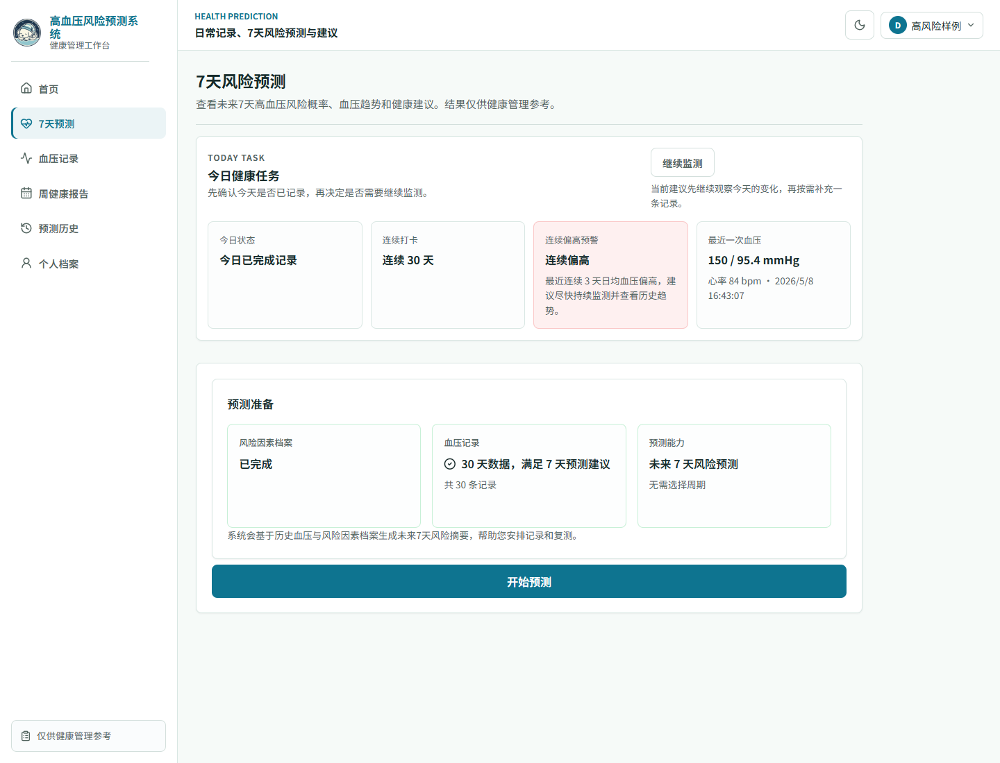
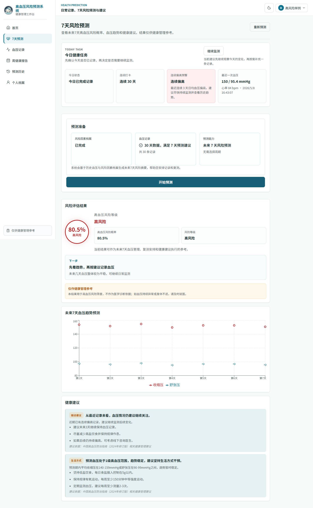

# 基于Prophet与LightGBM的高血压风险预测系统设计与实现

## 摘要

高血压是慢性病管理中的常见问题，用户在家庭血压计和健康平台中积累了大量连续血压记录，但这些数据往往只被用于保存和查询。现有健康管理系统对近期血压变化、短期风险提示和结果解释的支持仍不充分，难以帮助普通用户及时理解自身血压变化。

针对上述问题，本文设计并实现了一套基于 Prophet 与 LightGBM 的高血压风险预测辅助系统。系统先将用户血压记录按自然日聚合，并利用 Prophet 预测未来 7 天血压趋势，再将预测期血压特征与用户风险因素输入 LightGBM，得到高血压风险概率和风险等级。

实验结果表明，调参后的 LightGBM 模型在公开健康检查数据集上具有较好的分类效果，血压相关特征是影响模型判断的主要因素。系统链路验证表明，本文方法能够完成从血压趋势预测、风险分类到结果展示的完整流程，可为用户提供短期健康管理参考，但不能替代临床诊断和治疗决策。

**关键词**：高血压风险预测；Prophet；LightGBM；时间序列预测；健康管理系统

## Abstract

Hypertension is a common issue in chronic disease management, and users now accumulate continuous blood pressure records through home monitors and health platforms. However, these records are often used only for storage and query, while recent trend interpretation, short-term risk reminders, and result explanation remain insufficient.

To address this problem, this paper designs and implements a hypertension risk prediction assistance system based on Prophet and LightGBM. The system first aggregates user blood pressure records by natural day and uses Prophet to predict the blood pressure trend for the next seven days; it then feeds the predicted blood pressure features and user risk factors into LightGBM to obtain the risk probability and risk level.

Experimental results on a public health-check dataset show that the tuned LightGBM model achieves good classification performance, and blood-pressure-related features are the main factors affecting the model output. System pipeline validation shows that the proposed method can complete the workflow from blood pressure trend prediction and risk classification to result presentation, providing short-term health management references for users without replacing clinical diagnosis or treatment decisions.

**Key words**: hypertension risk prediction; Prophet; LightGBM; time series forecasting; health management system

## 第1章 绪论

### 1.1 研究背景及意义

高血压是我国慢性病防控和心血管健康管理中的重点问题之一。血压水平长期偏高会增加心脑血管事件发生风险，也会影响居民日常健康管理行为。《中国高血压防治指南（2024年修订版）》对血压分级、生活方式干预和健康管理提出了较为系统的建议[1]；《中国高血压健康管理规范（2019）》和《国家基层高血压防治管理指南（2020版）》也强调了连续监测、风险评估和规范化管理的重要性[2-3]。从心血管健康整体负担看，相关报告显示我国心血管疾病防控仍面临较大压力，高血压管理质量直接关系到居民长期健康水平[4]。

随着家庭血压计、可穿戴设备和互联网健康平台的普及，普通用户能够更加方便地记录个人血压数据。相比医院门诊中的单次测量，连续记录更能反映血压在一段时间内的变化方向、波动幅度和异常升高情况，这也与相关规范中强调的连续监测和风险评估要求一致[2-3]。但是，在实际使用中，许多系统仍主要停留在“记录、查询、统计”的层面，用户虽然能够看到历史数据，却不容易判断近期血压是否正在上升，也难以了解未来短期内是否需要提高关注程度。

现有健康管理系统通常以用户档案、血压记录和后台维护为主要功能，能够满足基本的数据管理需求，但对数据背后的风险信息挖掘不足。已有研究表明，高血压风险判断通常需要综合人口学特征、生活方式因素、血压指标和代谢指标等多类变量[5]。因此，高血压风险不仅与年龄、BMI、吸烟、用药、糖尿病等相对稳定的风险因素有关，也与近期收缩压、舒张压的变化趋势有关。如果只使用静态档案信息或最近一次血压值进行判断，容易忽略连续血压记录中包含的趋势信息；如果只展示趋势曲线，又难以形成用户能够直接理解的风险提示。因此，有必要设计一种能够连接血压趋势预测和结构化风险分类的辅助系统。

基于上述背景，本文围绕 Prophet 与 LightGBM 构建高血压风险预测辅助系统，研究意义首先体现在健康管理应用层面。系统将用户连续血压记录按自然日聚合，并预测未来 7 天血压变化趋势，使用户不再只看到零散的历史记录，而是能够了解近期血压变化方向和短期关注重点。随后，系统结合用户风险因素输出高血压风险概率和风险等级，用于帮助普通用户更早关注异常变化、改善记录习惯和调整健康管理行为。

本文的研究意义体现在模型衔接和结果解释层面。Prophet 用于从个人血压序列中提取预测期血压特征，LightGBM 用于综合预测期血压特征和结构化风险因素进行分类，两者串联后可以同时利用时间序列信息和个人档案信息。系统进一步将风险概率、血压趋势图、置信度说明和指南型健康建议组合展示，解决单纯模型分数不易理解的问题。需要说明的是，本文系统定位为健康管理辅助工具，预测结果用于提示用户关注近期血压变化和相关风险因素，不替代临床诊断、处方或治疗决策。

### 1.2 国内外研究现状

国内关于高血压风险预测的研究已经从经验判断逐步转向数据驱动建模。已有综述指出，高血压风险评估通常需要综合人口学特征、生活方式因素、血压指标和代谢指标等多类变量[5]。这说明高血压风险不是由单一指标决定的，单看某一次血压测量值或某一个生活习惯变量，都难以完整反映个体风险水平。因此，如何把多类健康数据组织成可用于建模的特征，是当前高血压风险预测研究中的重要基础。

在具体应用方面，国内研究已经开始使用多种机器学习方法处理不同人群和不同场景下的高血压风险预测问题。例如，钢铁工人高血压风险预测模型研究比较了多种机器学习模型，并使用 AUC、F1、Brier Score 等指标评价模型表现[6]。这类研究的价值在于，它不再只关注模型是否能给出分类结果，而是同时考察区分能力、综合识别效果和概率输出质量。原发性高血压不良心血管事件风险预测研究进一步说明，当数据类型更加丰富时，风险预测可以扩展到更复杂的临床事件判断场景[8]。

从数据来源看，国内外也有研究尝试使用较容易采集的健康指标完成基础筛查。基于易采集风险因素的高血压预测研究表明，年龄、体重、生活方式等普通用户较容易获得的变量也可以用于机器学习建模[7]。类似思路在其他慢性病预测中也较常见，例如体检人群糖尿病风险预测研究说明，机器学习模型可以基于体检指标构建风险评估模型，并通过 AUC 等指标评价模型区分能力[9]。这些研究为本文使用用户风险因素档案和血压相关指标进行 LightGBM 建模提供了参考。

不过，国内相关研究也存在一个比较明显的特点：多数研究更重视结构化静态特征，例如年龄、BMI、吸烟、用药、血糖、胆固醇等，而对连续血压记录中的时间变化利用相对有限。对于普通用户来说，健康管理并不只关心“是否存在风险因素”，还关心“最近一段时间血压是否在升高”“未来几天是否可能持续偏高”。如果系统只根据静态档案或最近一次测量值给出风险判断，容易忽略连续记录中包含的趋势信息。可解释机器学习研究表明，特征重要性和模型解释能够提高疾病预测结果的可理解性[10]，但仅有静态特征解释还不足以回答用户对近期血压变化的疑问。

国外研究在算法基础和系统呈现方面提供了较多可借鉴经验。Prophet 原始论文提出了面向大规模预测任务的加性时间序列模型，能够将趋势项、季节项和事件项组合起来描述时间序列变化[14]。LightGBM 原始论文提出了高效梯度提升决策树框架，通过直方图算法和叶子优先生长策略提升结构化数据建模效率[15]。这两类方法分别适合处理时间序列趋势和结构化表格特征，也为本文将血压趋势预测与风险分类衔接提供了方法基础。

在健康管理系统实现方面，国外高血压可视化风险预测系统研究说明，机器学习风险预测如果能够与可视化界面结合，用户更容易理解风险结果和相关影响因素[13]。这类研究提示，风险预测系统不能只停留在后端模型计算，还需要把模型输出转化为用户能够看懂的结果形式。国内关于 SARIMA 与 Prophet 混合算法的研究也说明，Prophet 在时间序列预测任务中具有较好的工程适配性[11]；高血压健康评估和基层健康管理研究则提示，系统需要把风险评估结果转化为用户能够理解和执行的管理建议[12]。

综合国内外研究可以看出，高血压风险预测、时间序列预测和机器学习分类都已经具备较好的研究基础，但仍有进一步结合的空间。第一，部分高血压风险预测研究主要依赖静态风险因素，对用户近期血压变化的连续性利用不足。第二，部分时间序列预测研究能够给出未来趋势，但如果没有进一步转化为风险概率、风险等级和健康建议，普通用户仍然难以理解趋势背后的健康含义。第三，部分系统虽然具备数据展示功能，但模型链路和结果解释不够清晰，容易变成简单的数据管理系统。

因此，本文的研究重点不是单独比较某一种算法，也不是只完成传统健康档案管理功能，而是将个人历史血压趋势预测与结构化风险分类连接起来。本文使用 Prophet 从连续血压记录中提取未来 7 天血压趋势特征，再使用 LightGBM 结合用户风险因素输出高血压风险概率，并在系统页面中展示风险等级、趋势图和健康建议。这样的设计能够弥补单次血压值或静态档案信息不足的问题，也能把模型结果转化为更直观的短期健康管理参考。

### 1.3 研究方法与内容

本文围绕“Prophet 血压趋势预测 + LightGBM 风险分类 + 预测结果展示”开展研究与实现。研究方法包括文献分析、模型设计、特征构建、实验评估和链路验证。文献分析用于确定高血压风险预测、时间序列预测和机器学习分类的相关基础；模型设计用于明确 Prophet 与 LightGBM 的输入输出关系；特征构建用于说明预测期血压特征如何进入风险分类模型；实验评估用于检验 LightGBM 分类效果、Prophet 预测误差和趋势融合作用；链路验证用于确认两个模型能够在预测页面中完成闭环调用。

本文主要工作包括以下几个方面。

第一，构建双模型预测链路。系统将用户历史血压记录按自然日聚合为每日血压序列，使用 Prophet 预测未来 7 天收缩压和舒张压，并将预测期血压均值作为 LightGBM 风险分类输入的一部分。该设计使系统既能考虑静态风险因素，也能纳入短期血压趋势。

第二，设计双模型预测流程。系统以风险因素和历史血压记录作为输入，先由 Prophet 生成未来 7 天收缩压和舒张压趋势，再由 LightGBM 输出高血压风险概率，最后结合趋势信号生成用户可理解的风险结果。

第三，完成模型训练与实验分析。本文使用公开数据文件 `Hypertension-risk-model-main.csv` 中的 4240 条样本训练 LightGBM，并通过 Accuracy、AUC、Precision、Recall、F1、PR-AUC、Brier Score 和混淆矩阵等指标评价模型效果。结合特征重要性分析，说明血压预测特征在风险分类中的贡献。

第四，完成预测链路验证。系统在预测页面中展示风险概率、风险等级、未来 7 天血压趋势和健康建议，用于说明两个模型的输入输出关系能够在实际流程中闭环运行。

## 第2章 相关理论介绍

### 2.1 时间序列预测

时间序列预测是根据历史时间顺序数据推断未来变化趋势的方法。对于血压记录而言，每次测量都包含测量时间、收缩压、舒张压和心率等信息，按时间排列后可形成血压变化序列。与普通分类特征不同，时间序列数据具有明显的先后关系，近期血压水平、波动幅度和变化方向都可能影响未来短期风险判断。

从数学形式看，若用户共有 $T$ 个按时间排序的血压观测点，可以将其表示为一个时间序列：

|  |  |
|:---:|---:|
| $\displaystyle \mathbf{Y}_{1:T}=\{y_1,y_2,\ldots,y_T\},\quad y_t=(SBP_t,DBP_t,HR_t)$ | (1) |

式中，$\mathbf{Y}_{1:T}$ 表示从第 1 个观测点到第 $T$ 个观测点组成的血压时间序列，$y_t$ 表示第 $t$ 次记录中的观测向量，$SBP_t$、$DBP_t$ 和 $HR_t$ 分别表示该次记录中的收缩压、舒张压和心率。系统建模时并不直接打乱这些记录，而是保留时间顺序，使模型能够利用“近期记录对未来判断更有参考价值”这一特点。

时间序列预测的目标，是根据最近一段历史观测值估计未来第 $h$ 个时间点的取值，可抽象表示为：

|  |  |
|:---:|---:|
| $\displaystyle \widehat{y}_{T+h}=f(y_T,y_{T-1},\ldots,y_{T-p+1}),\quad h=1,2,\ldots,H$ | (2) |

式中，$\widehat{y}_{T+h}$ 表示未来第 $h$ 个时间点的预测值，$p$ 表示模型使用的历史窗口长度，$H$ 表示预测步长。本文系统中的 $H$ 取 7，即根据用户近期血压记录预测未来 7 天的收缩压和舒张压变化。这样做的目的不是给出长期疾病结局判断，而是为后续风险分类提供更接近近期状态的血压特征。

实际血压序列通常不是完全平稳的。它可能同时包含长期升高或降低的趋势、短期重复波动以及测量误差。为了便于理解，可以将单变量时间序列简化分解为：

|  |  |
|:---:|---:|
| $\displaystyle y_t=\tau_t+s_t+r_t$ | (3) |

式中，$\tau_t$ 表示趋势项，用于描述整体上升或下降方向；$s_t$ 表示周期项或重复波动；$r_t$ 表示随机扰动和未被模型解释的部分。在健康管理场景下，用户测量时间可能不固定，记录频率也可能不均衡，因此需要在建模前进行聚合与清洗。本文将同一自然日内的一条或多条血压记录聚合为日均收缩压和日均舒张压，使 Prophet 输入序列更加稳定。

时间序列预测在本文系统中的基本处理流程如图 2-1 所示。用户原始血压记录先按时间排序，再进行自然日聚合，随后由 Prophet 生成未来 7 天血压趋势，最后将预测期均值等结果转换为 LightGBM 所需的血压特征。

本文的时间序列预测任务不是预测长期疾病结局，而是根据普通用户近期血压记录生成未来 7 天血压趋势。预测结果本身不直接构成高血压风险结论，而是进一步转换为 LightGBM 的预测期血压特征。这样可以避免只用最近一次血压值进行静态分类，也能让系统在预测结果页中展示未来 7 天血压走势，增强结果解释性。

### 2.2 Prophet模型

Prophet 是一种面向时间序列预测的加性模型，适合处理存在趋势、周期和异常波动的数据。其基本思想是把时间序列拆分为趋势、周期、事件影响和随机误差等可解释成分。基本形式可以表示为：

|  |  |
|:---:|---:|
| $\displaystyle y(t)=g(t)+s(t)+h(t)+\epsilon_t$ | (4) |

其中，$g(t)$ 表示趋势项，用于描述时间序列整体变化方向；$s(t)$ 表示季节性或周期项；$h(t)$ 表示节假日或特殊事件项；$\epsilon_t$ 表示误差项[14]。对于存在突变点的序列，Prophet 可用分段趋势表达不同阶段的变化速度，线性趋势项可抽象为：

|  |  |
|:---:|---:|
| $\displaystyle g(t)=(k+a(t)^{T}\delta)t+(m+a(t)^{T}\gamma)$ | (5) |

式中，$k$ 为基础增长率，$m$ 为偏置项，$a(t)$ 表示时间 $t$ 是否经过候选变化点的指示向量，$\delta$ 表示变化点前后趋势斜率的调整量，$\gamma$ 用于保证趋势函数在变化点处连续。在本文场景中，血压预测主要关注用户个人近期血压变化，因此系统重点使用趋势建模能力，不把 Prophet 输出解释为临床结论。

为了更直观说明 Prophet 在本文系统中的作用，图 2-2 给出了模型原理图。用户原始血压记录先被聚合为每日收缩压和舒张压序列，再进入 Prophet 加性模型。模型通过趋势项、周期项、事件项和误差项共同描述时间序列变化，并输出未来血压趋势。系统并不直接把该趋势作为高血压结论，而是进一步提取预测期均值、峰值、斜率和高血压天数等特征，供后续 LightGBM 风险分类使用。

Prophet 的优点在于模型结构较清晰，预测输出可以同时给出未来时间点和预测值，便于与系统页面中的趋势图结合。与直接使用最近一次血压值相比，Prophet 能够根据一段时间内的记录形成未来 7 天的连续趋势，使系统同时获得预测期血压均值、高血压天数、峰值和斜率等信息。对于普通用户而言，未来 7 天收缩压和舒张压预测曲线比单一概率更容易理解；对于 LightGBM 风险分类而言，Prophet 输出的未来 7 天预测均值可以作为结构化输入特征，参与风险概率计算。

本文系统在用户发起预测时基于个人血压历史记录训练或复用 Prophet 模型。为了平衡预测效果和交互效率，系统默认最多使用近期 90 天日均血压数据。若用户新增血压自然日数量达到重训阈值，系统重新训练 Prophet 模型；否则复用已有模型并重新生成预测结果。模型资产表只保存版本、数据签名、训练截止日期和存储键等索引信息；训练数据天数、置信度等级、参数画像和模型运行模式随单次预测记录保存，用于解释预测结果。

### 2.3 LightGBM模型

LightGBM 是一种高效的梯度提升决策树模型，适用于结构化表格数据分类与回归任务。梯度提升决策树通过多棵弱学习器逐步拟合损失函数的负梯度，最终形成加法模型。第 $M$ 轮后的模型可以表示为：

|  |  |
|:---:|---:|
| $\displaystyle F_M(x)=\sum_{m=1}^{M} f_m(x)$ | (6) |

其中，$x$ 表示输入特征，$f_m(x)$ 表示第 $m$ 棵决策树，$M$ 表示树的数量。LightGBM 在每轮训练时最小化损失函数与模型复杂度惩罚之和，其目标函数可写为：

|  |  |
|:---:|---:|
| $\displaystyle \mathcal{L}^{(m)}=\sum_{i=1}^{N}l(y_i,\hat{y}^{(m-1)}_i+f_m(x_i))+\Omega(f_m)$ | (7) |

式中，$l$ 表示样本损失函数，$\Omega(f_m)$ 表示树模型复杂度惩罚项。经过二阶泰勒展开后，每个叶子节点的最优权重与该叶子上样本的一阶梯度和二阶梯度有关：

|  |  |
|:---:|---:|
| $\displaystyle w_j^{*}=-\frac{G_j}{H_j+\lambda}$ | (8) |

其中，$G_j$ 和 $H_j$ 分别表示第 $j$ 个叶子节点上一阶梯度和二阶梯度之和，$\lambda$ 为正则化系数。

图 2-3 展示了 LightGBM 在本文风险分类任务中的计算逻辑。模型输入由两部分组成：一部分是年龄、性别、BMI、吸烟、用药和代谢指标等静态风险因素，另一部分是 Prophet 生成的预测期血压特征。LightGBM 通过多棵决策树逐步拟合风险判别函数，各树输出累加得到模型分数，再通过 Sigmoid 函数映射为原始风险概率。后续系统会在该概率基础上进行阈值判断和趋势融合。

对于二分类任务，模型输出可以经过 Sigmoid 变换得到属于正类的概率：

|  |  |
|:---:|---:|
| $\displaystyle p=P(y=1\mid x)=\frac{1}{1+e^{-F_M(x)}}$ | (9) |

图 2-4 给出了 Sigmoid 函数的概率映射曲线。当模型分数 $F_M(x)$ 较小时，输出概率接近低风险一侧；当模型分数逐渐增大时，风险概率随之上升。该曲线说明 LightGBM 的最终输出不是简单的类别标签，而是可用于阈值搜索、风险分级和趋势融合的概率值。

本文将高血压风险预测视为二分类概率输出任务，LightGBM 输出高血压风险概率，再由系统映射为低风险、中风险和高风险等级。

LightGBM 相比普通 GBDT 具有训练效率高、对大规模特征和样本适应性较强等特点。其主要优化包括直方图算法、叶子优先生长策略、特征采样和数据采样等机制[15]。在健康风险预测中，用户年龄、BMI、吸烟情况、糖尿病、胆固醇、血糖以及预测期血压均值等变量多为结构化特征，适合使用 LightGBM 建模。本文在调参阶段重点调整叶子数、特征采样比例、样本采样比例、正则化系数和最小叶子样本数，以控制树模型复杂度并改善查全率与 F1 表现。

本文的 LightGBM 输入包含 12 个核心特征，分别为性别、年龄、是否吸烟、日吸烟支数、是否服用降压药、是否糖尿病、总胆固醇、预测期收缩压均值、预测期舒张压均值、BMI、心率和血糖。其中，收缩压和舒张压来自 Prophet 对未来 7 天的趋势预测，其他字段来自普通用户维护的风险因素档案。LightGBM 原始概率进入风险融合策略后形成系统最终展示的风险概率。

### 2.4 本章小结

本章介绍了时间序列预测、Prophet 模型和 LightGBM 模型的基本原理，并通过模型原理图说明二者在系统中的作用边界。时间序列预测为血压趋势建模提供方法基础，Prophet 用于生成未来 7 天收缩压和舒张压预测，LightGBM 用于结合预测期血压特征和个人风险因素输出高血压风险概率。两类模型在系统中不是并列投票关系，而是串联关系：Prophet 先生成预测期血压特征，LightGBM 再完成风险分类。

## 第3章 实验数据集与评价指标

### 3.1 实验数据集介绍

本文没有自行采集受试者原始数据，而是使用和鲸社区公开数据集页面下载的健康检查数据文件 `Hypertension-risk-model-main.csv`，页面地址为 `https://www.heywhale.com/mw/dataset/6736f8d20bb59b78302c1397`。该数据文件包含 4240 条样本，字段覆盖年龄、性别、吸烟情况、降压药使用情况、糖尿病、总胆固醇、收缩压、舒张压、BMI、心率和血糖等信息。由于本文关注的是高血压风险辅助预测，模型训练前将原始数据中表示既往高血压状态的字段 `prevalentHyp` 整理为 `Risk` 标签。整理后正样本 1317 条，负样本 2923 条，正样本比例为 31.1%。后续实验均基于该整理后的训练数据完成。

数据集字段如表 3-1 所示。

**表3-1 LightGBM 训练特征说明**

| 字段 | 含义 | 来源 |
| --- | --- | --- |
| male | 性别二值特征 | 风险因素档案或训练数据 |
| age | 年龄 | 风险因素档案或训练数据 |
| currentSmoker | 是否当前吸烟 | 风险因素档案或训练数据 |
| cigsPerDay | 日吸烟支数 | 风险因素档案或训练数据 |
| BPMeds | 是否服用降压药 | 风险因素档案或训练数据 |
| diabetes | 是否糖尿病 | 风险因素档案或训练数据 |
| totChol | 总胆固醇 | 风险因素档案或训练数据 |
| sysBP | 收缩压 | 训练数据或 Prophet 预测期均值 |
| diaBP | 舒张压 | 训练数据或 Prophet 预测期均值 |
| BMI | 体质指数 | 由身高体重或数据字段得到 |
| heartRate | 心率 | 血压记录或训练数据 |
| glucose | 血糖 | 风险因素档案或训练数据 |

在真实系统预测时，`sysBP` 和 `diaBP` 不直接使用用户最近一次测量值，而是采用 Prophet 预测得到的未来 7 天收缩压均值和舒张压均值。这样做可以让 LightGBM 风险分类模型纳入短期血压趋势信息。其他风险因素来自用户在系统中维护的风险因素档案。系统不将盐摄入量、睡眠时长写入当前模型输入，这些字段仅作为后续扩展方向。

训练数据存在少量缺失值。根据本次重新训练生成的模型报告，`cigsPerDay` 缺失 29 条，`totChol` 缺失 50 条，`BMI` 缺失 19 条，`heartRate` 缺失 1 条，`glucose` 缺失 388 条。本文采用 LightGBM 原生缺失值处理策略，使模型能够在保留缺失信息的情况下完成训练。对于预测流程中的可缺失字段，系统不强制填补，而是交由 LightGBM 缺失值分裂机制处理。

### 3.2 数据预处理与特征构建

本文的数据预处理包括字段标准化、缺失值处理、训练测试划分、阈值验证集划分和预测期血压特征构建。训练阶段使用基础训练集作为主要数据来源，系统导出的训练样本可作为补充数据源。当前模型报告中系统导出样本数为 0，因此实验结果主要基于基础训练集。

模型训练时，数据集被划分为训练集、测试集、阈值验证集和 early-stop 验证集。其中训练集样本数为 3392，测试集样本数为 848，阈值验证集样本数为 340，early-stop 训练样本数为 2746，early-stop 验证样本数为 306，最终重训样本数为 3052。训练脚本先在 early-stop 验证集上确定最佳迭代轮数，再使用完整训练池重训最终模型，并在独立阈值集上搜索分类阈值。

对于用户实时预测，系统首先将原始血压记录按自然日聚合。若用户在同一天录入多条记录，则分别计算该日收缩压和舒张压均值：

|  |  |
|:---:|---:|
| $\displaystyle \overline{SBP}_d=\frac{1}{n_d}\sum_{i=1}^{n_d}SBP_{d,i}$ | (10) |

|  |  |
|:---:|---:|
| $\displaystyle \overline{DBP}_d=\frac{1}{n_d}\sum_{i=1}^{n_d}DBP_{d,i}$ | (11) |

其中，$n_d$ 表示第 $d$ 天的血压记录数量，$SBP_{d,i}$ 和 $DBP_{d,i}$ 分别表示第 $d$ 天第 $i$ 条记录中的收缩压和舒张压。聚合后的每日血压序列作为 Prophet 的训练输入。

Prophet 输出未来 7 天收缩压和舒张压预测值后，系统进一步构造预测期血压特征：

|  |  |
|:---:|---:|
| $\displaystyle SBP_{future}=\frac{1}{7}\sum_{k=1}^{7}\widehat{SBP}_{t+k}$ | (12) |

|  |  |
|:---:|---:|
| $\displaystyle DBP_{future}=\frac{1}{7}\sum_{k=1}^{7}\widehat{DBP}_{t+k}$ | (13) |

其中，$\widehat{SBP}_{t+k}$ 和 $\widehat{DBP}_{t+k}$ 表示 Prophet 对未来第 $k$ 天收缩压和舒张压的预测值。构造后的 $SBP_{future}$ 和 $DBP_{future}$ 分别映射到 LightGBM 的 `sysBP` 和 `diaBP` 特征。

### 3.3 模型评价指标

模型评价指标的选择需要和系统任务相匹配。本文的 LightGBM 模型不只是输出“高风险/非高风险”的二分类结果，还要为系统提供可展示的风险概率，因此评价时不能只看总体正确率；如果正负样本分布不完全均衡，单独使用 Accuracy 可能掩盖正类样本被漏判的问题。

结合医学风险分类和机器学习分类实验中常用的评价方式，本文使用 Accuracy、Precision、Recall、F1、AUC、PR-AUC、Brier Score 和混淆矩阵评价模型。上述指标各有侧重点：Accuracy 反映总体预测正确比例，Precision 反映模型提示为高风险时的可信程度，Recall 反映真实高风险样本被识别出来的比例，F1 用于综合观察 Precision 与 Recall 的平衡关系，AUC 和 PR-AUC 用于评价不同阈值下的排序区分能力，Brier Score 用于观察概率输出是否适合风险展示，混淆矩阵则能直接呈现 TP、TN、FP 和 FN 的数量关系。设 TP 表示正类预测正确数量，TN 表示负类预测正确数量，FP 表示负类被误判为正类数量，FN 表示正类被误判为负类数量，则 Accuracy 表示总体预测正确比例：

|  |  |
|:---:|---:|
| $\displaystyle Accuracy=\frac{TP+TN}{TP+TN+FP+FN}$ | (14) |

Precision 表示预测为正类的样本中真实正类比例：

|  |  |
|:---:|---:|
| $\displaystyle Precision=\frac{TP}{TP+FP}$ | (15) |

Recall 表示真实正类样本被模型识别出的比例：

|  |  |
|:---:|---:|
| $\displaystyle Recall=\frac{TP}{TP+FN}$ | (16) |

F1 值是 Precision 与 Recall 的调和平均：

|  |  |
|:---:|---:|
| $\displaystyle F1=\frac{2\times Precision\times Recall}{Precision+Recall}$ | (17) |

AUC 衡量模型在不同分类阈值下对正负样本的区分能力，不直接受某一个固定分类阈值影响。由于本文关注正类样本识别，PR-AUC 可以补充观察正类识别效果；同时，系统前端需要展示风险概率，Brier Score 能够衡量概率预测与真实标签之间的均方误差，其值越小，说明概率输出越接近真实标签：

|  |  |
|:---:|---:|
| $\displaystyle Brier=\frac{1}{N}\sum_{i=1}^{N}(p_i-y_i)^2$ | (18) |

其中，$p_i$ 表示第 $i$ 个样本的预测概率，$y_i$ 表示真实标签。本文保留这些指标，并不是为了堆叠评价项，而是为了从“能否区分”“是否漏判”“提示是否可信”和“概率是否可用”四个角度检查模型结果，使后续实验分析更容易对应系统实际用途。

### 3.4 本章小结

本章介绍了 LightGBM 训练数据集、主要特征、缺失值情况、数据划分方式和模型评价指标。本文的关键特征构建在于将 Prophet 未来 7 天血压预测结果转化为 LightGBM 输入特征，从而将时间序列预测与结构化风险分类连接起来。下一章将围绕该双模型预测链路展开系统设计。

## 第4章 双模型预测算法设计

### 4.1 Prophet血压趋势预测方法

系统中的 Prophet 模型用于完成普通用户未来 7 天血压趋势预测。用户在血压记录页面录入收缩压、舒张压、心率和记录时间后，系统按自然日聚合记录，形成每日收缩压均值和舒张压均值序列。预测前，系统会检查血压记录自然日数量是否满足最低要求；若不足，则提示用户继续记录血压，不创建预测记录。

如图 4-1 所示，Prophet 预测流程包括血压记录读取、自然日聚合、训练上下文构造、模型复用或重训判断、未来 7 天预测和预测说明生成。系统默认最多使用近期 90 天日均血压数据参与 Prophet 训练，以避免过长历史数据对近期趋势造成干扰，同时控制预测响应时间。Prophet 输出的预测点首先被转换为预测期血压特征：

|  |  |
|:---:|---:|
| $\displaystyle X_{bp}^{future}=\left[\frac{1}{7}\sum_{k=1}^{7}\widehat{SBP}_{t+k},\frac{1}{7}\sum_{k=1}^{7}\widehat{DBP}_{t+k}\right]$ | (19) |

式中，$X_{bp}^{future}$ 表示 LightGBM 所需的未来 7 天血压特征，$\widehat{SBP}_{t+k}$ 与 $\widehat{DBP}_{t+k}$ 分别表示 Prophet 对未来第 $k$ 天收缩压和舒张压的预测值。这样处理后，系统输入 LightGBM 的血压变量不再是单次测量值，而是带有短期趋势信息的预测期均值。

为了适应不同用户的数据情况，系统根据历史数据长度和波动情况生成参数画像，包括 `short`、`standard` 和 `volatile` 三类。对于记录较少的用户，系统采用更保守的参数设置；对于波动较大的血压序列，系统在预测说明中保留置信度原因。Prophet 输出不仅包含未来 7 天预测点，还包含训练数据天数、是否截断历史窗口、模型运行模式和置信度等级，这些说明随预测记录保存，而不是堆叠到模型资产表中。

系统没有简单地在每次预测时都重新训练 Prophet 模型，而是采用模型复用与增量重训策略。若用户自上次训练以来新增血压自然日数量未达到重训阈值，系统复用已有 Prophet 模型并重新生成预测结果；若新增自然日达到阈值，则重新训练模型。需要强调的是，系统复用的是模型资产，而不是旧预测结果。每次用户成功发起 7 天风险预测后，系统都会生成新的预测记录，保证历史结果可追踪。由于预测周期已经固定为未来 7 天，模型缓存键和文件存储路径不再包含可变预测周期槽位，旧版按预测天数分层的模型资产可在清理后由下一次预测重新生成。

### 4.2 LightGBM风险分类方法

LightGBM 风险分类模块接收用户个人风险因素和 Prophet 预测期血压特征，输出高血压风险概率。普通用户在风险因素档案中维护年龄、性别、身高、体重、吸烟情况、降压药使用情况、糖尿病、胆固醇和血糖等信息。系统根据身高和体重计算 BMI，并与 Prophet 预测得到的未来 7 天收缩压均值、舒张压均值共同组成 LightGBM 输入。

如图 4-2 所示，LightGBM 输入特征分为两类。第一类是静态或相对稳定的用户风险因素，如年龄、性别、BMI、吸烟、用药、糖尿病、总胆固醇和血糖。第二类是预测期血压特征，即 Prophet 对未来 7 天收缩压和舒张压预测值的均值。为便于书写，先将这些字段合并记为 LightGBM 输入向量，再表示模型输出的原始风险概率：

|  |  |
|:---:|---:|
| $\displaystyle \begin{aligned} \mathbf{x}_{LGBM}=&(male,age,smoker,cigsPerDay,BPMeds,diabetes,\\ &totChol,SBP_{future},DBP_{future},BMI,heartRate,glucose),\\ p_{raw}=&F_{LGBM}(\mathbf{x}_{LGBM}) \end{aligned}$ | (20) |

其中，$\mathbf{x}_{LGBM}$ 表示输入 LightGBM 的特征向量，$F_{LGBM}$ 表示训练完成的 LightGBM 分类器，$p_{raw}$ 表示未经过趋势融合的高血压风险概率。系统再结合趋势方向、高血压天数、趋势斜率、波动程度和用药信号进行工程融合，得到最终展示的风险概率。

风险概率映射为风险等级后返回给前端。本文系统采用低风险、中风险和高风险三个层级进行展示，目的是帮助普通用户理解风险大小，而不是给出临床分级结论。对于可缺失的模型输入字段，系统保留缺失值并交由 LightGBM 原生缺失值策略处理。

### 4.3 双模型特征衔接与趋势融合

本文系统的核心不是单一模型预测，而是 Prophet 与 LightGBM 串联形成的双模型预测链路。该链路先通过 Prophet 从用户历史血压记录中提取未来 7 天血压趋势，再通过 LightGBM 综合预测期血压特征和用户风险因素输出高血压风险概率。

如图 4-3 所示，一次完整预测包括以下步骤。首先，用户完善风险因素档案并录入血压记录，系统校验档案最低完整性和血压记录自然日数量。随后，Prophet 基于每日血压序列生成未来 7 天收缩压和舒张压预测，系统计算预测期血压均值并写入 LightGBM 输入特征。LightGBM 输出原始风险概率后，风险融合模块根据趋势和用药信号调整概率，建议模块基于风险等级、血压分级、趋势方向、预测期高血压天数和置信度生成指南型健康建议。最后，系统保存预测记录并返回用户端预测摘要。

为进一步明确两个模型之间的计算关系，本文将双模型联合预测过程整理为图解形式，如图 4-4 所示。

图 4-4 体现了本文的核心设计：Prophet 的输出不是最终风险结论，而是 LightGBM 的动态血压输入；LightGBM 的输出也不是临床诊断结果，而是用于健康管理参考的原始风险概率。趋势融合模块位于两个模型输出之后，综合高血压天数、峰值、斜率和用药状态等信号，只在概率层面做受约束的小幅修正，用于增强结果与近期血压走势之间的一致性。

在融合前，系统先从 Prophet 的未来 7 天预测点中提取高血压天数比例和趋势斜率等信号：

|  |  |
|:---:|---:|
| $\displaystyle r_{high}=\frac{1}{7}\sum_{k=1}^{7}\mathbb{I}(\widehat{SBP}_{t+k}\ge140\ \text{or}\ \widehat{DBP}_{t+k}\ge90)$ | (21) |

|  |  |
|:---:|---:|
| $\displaystyle s_{SBP}=\widehat{SBP}_{t+7}-\widehat{SBP}_{t+1},\quad s_{DBP}=\widehat{DBP}_{t+7}-\widehat{DBP}_{t+1}$ | (22) |

其中，$r_{high}$ 表示预测期内达到高血压阈值的天数比例，$s_{SBP}$ 和 $s_{DBP}$ 分别表示 7 天预测期内收缩压和舒张压的首尾变化量。趋势融合的调整项可以概括为：

|  |  |
|:---:|---:|
| $\displaystyle \Delta_{trend}=\min(0.08,0.08r_{high})+0.02I_{peak}+0.02I_{up}-0.02I_{stable}$ | (23) |

式中，$I_{peak}$ 表示预测期是否出现收缩压不低于 150 mmHg 或舒张压不低于 95 mmHg 的峰值，$I_{up}$ 表示预测期是否存在明显上升趋势，$I_{stable}$ 表示是否为稳定低血压趋势。若用户正在服用降压药但预测期仍出现高血压或峰值血压，系统额外引入 $\Delta_{med}=0.02$ 的用药未控制修正项。最终融合概率为：

|  |  |
|:---:|---:|
| $\displaystyle p_{fused}=clip(p_{raw}+\Delta_{trend}+\Delta_{med},0.01,0.99)$ | (24) |

其中，$p_{raw}$ 表示 LightGBM 原始概率，$\Delta_{trend}$ 表示趋势相关调整量，$\Delta_{med}$ 表示用药相关调整量，`clip` 表示将概率限制在合理区间内。风险等级映射规则为：

|  |  |
|:---:|---:|
| $\displaystyle Level(p)= \begin{cases} 低风险,&p<0.30\\ 中风险,&0.30\le p<0.60\\ 高风险,&p\ge0.60 \end{cases}$ | (25) |

上述公式是工程融合策略的抽象表达，用于解释系统如何综合模型输出和趋势信号，不表示临床风险模型。融合策略的设计边界是“小幅修正”：它不替代 LightGBM 分类器，只在模型概率基础上加入可解释的血压趋势信号，使最终展示结果更贴近用户近期血压变化。

### 4.4 预测流程与页面展示

系统页面在本文中只作为双模型预测链路的落地展示，不展开登录、后台管理、数据库结构和普通数据维护页面。用户侧预测流程可以概括为：维护必要风险因素和血压记录，进入 7 天风险预测页面发起预测，系统依次执行 Prophet 趋势预测、LightGBM 风险分类和趋势融合，最后在结果页面展示风险概率、风险等级、未来 7 天血压趋势和健康建议。

7 天风险预测页用于展示预测前数据准备状态和预测入口。

如图 4-5 所示，预测页强调 7 天预测能力，并根据风险因素档案和血压记录状态给出可行动提示。若最低数据条件不足，系统不会直接输出风险结果，而是提示用户继续完善风险因素或补充血压记录。该页面体现了双模型预测前的数据入口和校验过程。

预测结果页展示双模型预测输出。

如图 4-6 所示，预测结果包括高血压风险概率、风险等级、未来 7 天血压趋势图和指南型健康建议。其中，血压趋势来自 Prophet 预测结果，风险概率来自 LightGBM 原始概率及趋势融合后的结果。该页面只展示普通用户能够理解的预测摘要，不展开模型输入快照、数据库字段或后台治理信息。

### 4.5 本章小结

本章围绕 Prophet 与 LightGBM 两个模型展开算法设计。Prophet 负责从历史血压记录中生成未来 7 天血压趋势，LightGBM 负责结合预测期血压特征和用户风险因素输出风险概率，趋势融合模块在原始概率基础上进行小幅可解释修正。系统页面只用于展示预测入口和预测结果，服务于算法链路验证而不是作为正文主要研究对象。

## 第5章 模型训练与实验结果分析

### 5.1 实验环境

本文系统采用前后端分离架构，模型训练和后端服务均在 Python 环境中完成。实验与开发环境如表 5-1 所示。

**表5-1 实验与系统环境**

| 类别 | 配置 |
| --- | --- |
| 后端语言 | Python |
| 后端框架 | Flask、Flask-SQLAlchemy、Flask-Migrate |
| 前端框架 | React、TypeScript、React Router |
| 数据库 | MySQL 8 |
| 模型方法 | Prophet、LightGBM |
| 调参方法 | Optuna + LightGBMTunerCV |
| 训练入口 | `backend/scripts/train_models.py` |
| 模型报告 | `docs/reports/model_report.md` |

训练脚本固定执行数据准备、Baseline 训练、LightGBMTunerCV 调参、最终训练和模型产物保存五个阶段。训练产物包括 LightGBM 模型文件、模型配置、训练元信息和模型报告。为保证实验可复现，训练数据 hash 在生成前按固定列排序，避免不同随机种子导致样本顺序变化而影响数据指纹；`max_boost_rounds` 和 `early_stopping_rounds` 也会传入 LightGBMTunerCV 调参阶段，使参数文件中的训练窗口设置能够真正影响调参过程。Prophet 不在训练脚本中预先训练所有用户模型，而是在用户发起预测时基于个人血压记录实时训练或复用。

### 5.2 LightGBM训练结果分析

#### 5.2.1 调参前后性能对比

本文将 Baseline 模型和调参后的 Tuned 模型进行对比。两组均采用同一数据集、同一随机种子和同一最大化 F1 阈值策略，差异主要来自 LightGBMTunerCV 选择的模型参数。性能指标如表 5-2 所示。

**表5-2 LightGBM 模型性能对比**

| 指标 | Baseline | Tuned |
| --- | ---: | ---: |
| Accuracy | 0.8903 | 0.9021 |
| AUC | 0.9464 | 0.9480 |
| Precision | 0.7690 | 0.8125 |
| Recall | 0.9240 | 0.8897 |
| F1 | 0.8394 | 0.8494 |
| PR-AUC | 0.8688 | 0.8678 |
| Brier Score | 0.0841 | 0.0829 |
| Threshold | 0.47 | 0.67 |
| Best Iteration | 76 | 65 |

从表 5-2 可以看出，Baseline 和 Tuned 模型的 AUC 均约为 0.95，说明模型整体区分能力较强。调参后 AUC 从 0.9464 提升到 0.9480，Brier Score 从 0.0841 降低到 0.0829，概率输出略有改善；Precision 从 0.7690 提升到 0.8125，F1 从 0.8394 提升到 0.8494，说明调参后模型在保持较高 Recall 的同时减少了误报并改善了综合识别效果。Recall 从 0.9240 降至 0.8897，但仍处于较高水平，因此这种变化不是简单的性能下降，而是在查全率和查准率之间取得了更适合系统展示的平衡。

本次 LightGBMTunerCV 调参主要调整了树模型复杂度和采样策略。与 Baseline 参数相比，Tuned 模型将 `num_leaves` 从 31 调整为 11，引入 `min_child_samples=20` 限制叶子节点过细分裂；将 `feature_fraction` 调整为 0.9000、`bagging_fraction` 调整为 0.9797、`bagging_freq` 调整为 7；同时引入 `lambda_l1`、`lambda_l2` 和 `scale_pos_weight=2.2182`。这些参数并不是让所有指标同步上升，而是在保持 AUC 基本稳定的前提下，提高 Precision 和 F1，并使分类阈值从 0.4651 提升到 0.6676。考虑到本系统面向普通用户健康管理参考，最终采用 Tuned 模型作为系统风险分类模型，并保留阈值、校准和特征重要性信息。

Tuned 模型在测试集上的混淆矩阵如表 5-3 所示。

**表5-3 Tuned 模型混淆矩阵**

| 指标 | 数值 |
| --- | ---: |
| TN | 531 |
| FP | 54 |
| FN | 29 |
| TP | 234 |

测试集共有 848 个样本，其中正类样本 263 个、负类样本 585 个。混淆矩阵显示，Tuned 模型识别出 234 个正类样本，正类识别比例为 88.97%，仍有 29 个正类样本未被识别，漏判比例为 11.03%；在负类样本中，模型正确识别 531 个，负类正确识别比例为 90.77%，误报 54 个，误报比例为 9.23%。从比例上看，该模型对高风险样本的识别效果较好，漏判控制在较低水平，但仍存在一定误报，因此本文不将其表述为临床准确率，只将其作为给定数据集上的风险分类实验结果。结合 AUC、PR-AUC 和 Brier Score 可以看出，模型具备较好的排序区分能力，概率输出也可作为系统风险展示的实验依据。

#### 5.2.2 训练参数配置对照实验

本节对比的是训练配置，而不是更换输入特征。对照组采用原训练参数配置：`seed=42`、`test_size=0.2`、`threshold_valid_size=0.1`、`cv_splits=5`、`early_stopping_rounds=50`、`max_boost_rounds=1000`、`missing_value_strategy=native`、`learning_rate=0.05`、`bp_meds_policy=neutralized_for_conservative_inference`、`label_mode=diagnosis_plus_rule`，并使用 `recall_priority` 阈值策略和 `threshold_min_recall=0.75`。实验组保留上述训练参数不变，只将阈值搜索方式改为 `f1`，并取消 Recall 下限约束。这样设计的目的，是单独观察阈值搜索策略对最终分类结果的影响，避免把数据划分、调参轮数、缺失值处理或标签规则混在一起比较。

在新的训练链路中，阈值验证集与 early stopping 验证集被拆开使用。模型先在 early stopping 验证集上确定最佳迭代轮数，再用训练池重训，最后在独立阈值验证集上搜索分类阈值。因此，两组实验的模型训练过程一致，主要差异来自最后一步阈值选择。实验结果见表 5-4。

**表5-4 训练参数配置对照结果**

| 项目 | 对照组（原训练配置） | 实验组（F1 阈值配置） | 差异 |
| --- | --- | --- | --- |
| threshold_search_mode | recall_priority | f1 | 仅改变阈值搜索方式 |
| threshold_min_recall | 0.75 | 无 | 取消固定 Recall 下限 |
| AUC | 0.9480 | 0.9480 | ±0.0000 |
| PR-AUC | 0.8678 | 0.8678 | ±0.0000 |
| Brier Score | 0.0829 | 0.0829 | ±0.0000 |
| Accuracy | 0.8797 | 0.9021 | +0.0224 |
| Precision | 0.8286 | 0.8125 | -0.0161 |
| Recall | 0.7719 | 0.8897 | +0.1178 |
| F1 | 0.7992 | 0.8494 | +0.0502 |
| Threshold | 0.7732 | 0.6676 | -0.1056 |
| FP | 42 | 54 | +12 |
| FN | 60 | 29 | -31 |
| TP | 203 | 234 | +31 |

从表 5-4 可以看出，两组 AUC、PR-AUC 和 Brier Score 完全一致。这不是实验无效，而是因为两组使用同一个调参后的模型，样本的概率排序和概率输出没有改变；发生变化的是“概率达到多少才被判为高风险”。原训练配置的阈值为 0.7732，判定更严格，因此 Precision 较高，但在 263 个真实正类样本中只识别出 203 个，漏判 60 个。实验组阈值降为 0.6676 后，识别出 234 个正类样本，漏判数从 60 个降到 29 个，少漏 31 个正类样本，漏判数量下降 51.67%。

实验组的代价是误报数从 42 个增加到 54 个，Precision 从 0.8286 降到 0.8125，下降 1.61 个百分点。但它的 Recall 从 0.7719 提升到 0.8897，F1 从 0.7992 提升到 0.8494，Accuracy 也从 0.8797 提升到 0.9021。对于本文系统来说，预测结果用于健康管理提醒，不用于临床确诊。相比少量增加误报，减少潜在高风险样本漏判更符合系统用途，因此本文最终采用实验组的 `f1` 阈值配置。原训练配置仍可作为更保守的方案，用于需要更严格控制误报的场景。

### 5.3 特征重要性分析

LightGBM 可以输出基于 gain 的特征重要性，用于分析不同输入特征对模型分类的贡献。表 5-5 展示了主要特征的重要性占比。

**表5-5 LightGBM 特征重要性**

| 排名 | 特征 | 重要性（gain） | 占总 gain 比例 |
| --- | --- | ---: | ---: |
| 1 | sysBP | 26513.8 | 70.8% |
| 2 | diaBP | 6938.2 | 18.5% |
| 3 | BMI | 1280.8 | 3.4% |
| 4 | age | 810.8 | 2.2% |
| 5 | heartRate | 575.1 | 1.5% |
| 6 | glucose | 477.0 | 1.3% |
| 7 | totChol | 444.3 | 1.2% |
| 8 | cigsPerDay | 255.8 | 0.7% |
| 9 | male | 136.5 | 0.4% |
| 10 | currentSmoker | 0.0 | 0.0% |
| 11 | BPMeds | 0.0 | 0.0% |
| 12 | diabetes | 0.0 | 0.0% |

从表 5-5 可以看出，`sysBP` 和 `diaBP` 的特征增益占比分别为 70.8% 和 18.5%，两者合计达到 89.4%。这说明血压相关特征是模型风险判断的核心依据，也从实验上支持了本文将 Prophet 预测期血压特征接入 LightGBM 的设计。BMI、年龄和心率等特征也具有一定贡献，说明结构化风险因素仍然对模型输出有补充作用。

部分特征如糖尿病、是否吸烟、性别和是否服用降压药的增益较低，可能与样本分布、缺失比例、变量编码方式或该数据集中的区分度有关。对于树模型而言，后续优化更适合从样本质量、特征工程、外部验证和阈值策略入手，而不是简单套用神经网络中的梯度优化表述。

### 5.4 Prophet预测精度回测分析

Prophet 在本系统中承担用户级血压趋势预测任务。与 LightGBM 不同，Prophet 模型不使用统一的离线训练集预先生成所有用户模型，而是在用户发起 7 天风险预测时，根据该用户的历史血压记录训练或复用个人模型。这样可以使趋势预测更贴合用户个人近期血压变化。

为了兼顾响应速度和预测稳定性，系统默认使用最近 90 天日均血压序列作为训练窗口。当用户历史记录超过 90 天时，系统截取近期数据并在预测记录的训练说明中保留窗口截断信息；当记录天数较少或波动较大时，系统生成较低置信度说明。模型资产表只保存可复用模型所需的版本、数据签名、训练截止日期和文件存储键，预测结果页面向普通用户展示未来 7 天趋势图、风险等级和建议摘要。

系统采用模型复用与重训阈值策略。若用户新增血压自然日未达到阈值，系统复用已保存的 Prophet 模型，减少训练开销；若新增自然日达到阈值，则重新训练模型并更新模型元数据。

为了量化 Prophet 在不同数据条件下的预测能力，本文使用 Prophet 内置 `cross_validation` 对五种模拟血压 profile 进行 7 天预测回测。五种 profile 分别为正常稳定（~120/80）、偏高稳定（~135/87）、高血压稳定（~155/95）、上升趋势（120→145）和高波动（~130/85±大）。回测在 30 天、60 天和 90 天三种历史数据长度下进行，结果如表 5-6 所示。

**表5-6 Prophet 7 天预测收缩压 MAE（mmHg）**

| Profile | 30天 | 60天 | 90天 |
| --- | ---: | ---: | ---: |
| 正常稳定 (~120/80) | 5.19 | 3.02 | 3.42 |
| 偏高稳定 (~135/87) | 6.02 | 3.77 | 4.28 |
| 高血压稳定 (~155/95) | 7.09 | 4.52 | 5.14 |
| 上升趋势 (120→145) | 5.21 | 3.02 | 3.43 |
| 高波动 (~130/85±大) | 12.92 | 9.91 | 10.41 |

从表 5-6 可以看出，对稳定血压 profile，历史记录达到 30 天及以上时，Prophet 7 天预测的收缩压 MAE 在 3-7 mmHg 范围内，60 天数据下 MAE 最低。高波动 profile 的 MAE 约为 10-13 mmHg，显著高于稳定 profile，说明系统将此类序列标记为 `volatile` 参数画像并降低置信度是合理的。上升趋势 profile 的 MAE 与正常稳定接近，说明 Prophet 能够捕获短期趋势方向。

需要说明的是，本文不将 Prophet 回测指标作为临床预测准确率。Prophet 输出的主要作用是为 LightGBM 提供预测期血压特征，并在用户端趋势图中增强预测结果的解释性。

### 5.5 趋势融合效果分析

系统在 LightGBM 输出原始风险概率后，通过趋势融合模块结合 Prophet 预测的 7 天血压趋势信号和用药信号对概率进行调整。为了量化趋势融合的实际影响，本文构造了 8 个典型血压预测场景，对每个场景分别模拟低、中、高三个原始概率水平，共 24 次融合评价。融合信号包括高血压天数、血压峰值、上升趋势、稳定低趋势和药物未控制等五类。

部分场景的融合效果如表 5-7 所示。

**表5-7 趋势融合效果（部分场景）**

| 场景 | 原始概率 | 融合后概率 | 调整量 | 触发信号 |
| --- | ---: | ---: | ---: | --- |
| 正常稳定低血压 | 0.35 | 0.3500 | 0 | — |
| 偏高血压稳定 | 0.45 | 0.4800 | +0.03 | elevated_bp_days |
| 高血压稳定 | 0.50 | 0.6000 | +0.10 | high_bp_days, peak_bp |
| 上升趋势 | 0.45 | 0.4929 | +0.04 | high_bp_days, upward_trend |
| 服药但未控制 | 0.50 | 0.6200 | +0.12 | high_bp_days, peak_bp, meds_uncontrolled |
| 高波动 | 0.45 | 0.5043 | +0.05 | high_bp_days, peak_bp |

24 次评价中，风险等级发生上调的情况为 2 次（高血压稳定和服药未控制场景在中等原始概率下触发），其余 22 次风险等级保持不变。总调整量范围为 [0, +0.12]，平均绝对调整量为 0.0502。

从结果可以看出，趋势融合的调整幅度是受约束的，设计意图在于对 LightGBM 原始概率进行微调，而不是大幅改变模型判断。高血压天数和血压峰值是最常触发的信号；稳定低血压场景不产生向上调整，避免了对正常用户的过度预警；服药但血压未控制的场景叠加了最大调整量，反映了服药后仍高血压的额外风险。

### 5.6 预测链路验证

为验证两个模型能够在实际预测流程中完成衔接，本文对“输入数据 -> Prophet 趋势预测 -> LightGBM 风险分类 -> 趋势融合 -> 页面展示”的关键节点进行链路检查。验证重点不是覆盖系统全部功能，而是确认算法链路在系统页面中能够被正确调用和展示。结果如表 5-8 所示。

**表5-8 双模型预测链路验证结果**

| 验证环节 | 验证内容 | 预期结果 | 结果 |
| --- | --- | --- | --- |
| 风险因素输入 | 检查年龄、性别、BMI、吸烟、用药、糖尿病、胆固醇、血糖等字段 | 可组成 LightGBM 结构化输入特征 | 通过 |
| 血压序列输入 | 检查收缩压、舒张压、心率和记录时间 | 可按自然日聚合为 Prophet 输入序列 | 通过 |
| 预测前校验 | 在风险因素或血压自然日不足时发起预测 | 不直接输出风险结果，提示补充数据 | 通过 |
| Prophet 预测 | 满足条件后发起 7 天预测 | 返回未来 7 天收缩压、舒张压预测点和训练说明 | 通过 |
| 特征衔接 | 将 Prophet 预测结果转换为 `sysBP`、`diaBP` | 形成 LightGBM 所需预测期血压均值 | 通过 |
| LightGBM 分类 | 输入预测期血压特征和个人风险因素 | 返回原始高血压风险概率 | 通过 |
| 趋势融合 | 根据预测期高血压天数、峰值、趋势方向和用药信号修正概率 | 输出受约束的最终风险概率 | 通过 |
| 结果展示 | 查看风险概率、风险等级、趋势图和健康建议 | 页面展示用户可理解的预测摘要 | 通过 |

验证结果表明，Prophet 与 LightGBM 的串联关系能够在实际预测流程中闭环运行。Prophet 输出的未来 7 天血压预测点能够转化为 LightGBM 输入特征，LightGBM 原始概率能够进一步结合趋势信号形成最终展示结果，预测页面也能呈现风险概率、趋势图和健康建议。因此，系统部分在本文中的作用是验证双模型算法链路可以落地运行，而不是作为独立的管理系统展开讨论。

### 5.7 本章小结

本章介绍了实验环境、LightGBM 训练结果、特征重要性、Prophet 预测精度回测、趋势融合效果分析和双模型预测链路验证。实验结果表明，LightGBM 在测试集上具有较好的分类效果，血压相关特征是模型最主要的判别信号；Prophet 在历史数据达到 30 天以上时，7 天预测收缩压 MAE 在 3-7 mmHg 范围内；趋势融合对高血压场景和服药未控制场景产生向上修正，调整幅度在 [0, +0.12] 区间内。链路验证说明，Prophet 预测期血压特征能够顺利进入 LightGBM 风险分类模型，并在页面中形成可理解的预测结果。

## 第6章 总结与展望

### 6.1 总结

本文围绕《基于Prophet与LightGBM的高血压风险预测系统设计与实现》这一题目，设计并实现了一套面向普通用户的高血压风险预测辅助系统。系统以 Prophet 和 LightGBM 双模型预测链路为核心，避免将论文写成传统管理系统。Prophet 负责根据用户历史血压记录预测未来 7 天收缩压和舒张压趋势，LightGBM 负责结合预测期血压特征和用户风险因素输出高血压风险概率。

在预测流程实现方面，本文围绕两个模型完成了风险因素输入、血压记录输入、7 天风险预测、风险结果展示和指南型健康建议生成。系统页面只作为算法链路落地验证：用户发起预测后，后端完成 Prophet 趋势预测、LightGBM 风险分类和趋势融合，前端展示风险概率、风险等级和未来 7 天血压趋势。

在实验方面，本文使用 `Hypertension-risk-model-main.csv` 中的 4240 条样本训练 LightGBM 风险分类模型。调参后模型 AUC 达到 0.9480，Recall 达到 0.8897，F1 达到 0.8494，PR-AUC 达到 0.8678。阈值策略对照实验表明，最大化 F1 的配置在 Precision 保持 0.8125 的同时减少了漏报样本，更适合本文健康风险辅助提醒的应用目标。特征重要性分析表明，收缩压和舒张压的特征增益占比合计为 89.4%，验证了血压特征在风险分类中的重要作用，也支撑了将 Prophet 预测期血压特征输入 LightGBM 的设计思路。Prophet 回测表明，历史数据达到 30 天以上时，7 天预测收缩压 MAE 在 3-7 mmHg 范围内。趋势融合模块在 24 次场景评价中，调整幅度控制在 [0, +0.12] 区间内，体现了微调而非颠覆 LightGBM 原始判断的设计意图。

### 6.2 展望

本文系统仍有进一步完善空间。在风险因素维度方面，盐摄入量、睡眠时长、运动频率和饮食习惯等字段尚未作为模型输入，后续可在数据采集充分后纳入用户个人风险因素。在模型验证方面，当前实验主要基于基础训练集，后续可引入更多来源数据，对模型概率校准、不同人群泛化能力和阈值稳定性进行进一步验证；Prophet 趋势预测目前主要作为风险分类特征和趋势展示依据，后续也可增加更系统的预测误差分析。

在工程扩展方面，后续可进一步优化预测页面的数据质量提示、模型置信度解释和趋势可视化方式，使普通用户更容易理解模型输出。用户端未来也可根据记录习惯和风险变化提供更细粒度的健康管理提醒，但仍应坚持健康管理参考边界，不输出诊断结论、处方或治疗方案。

## 致谢

在本课题完成过程中，指导教师在选题方向、系统设计和论文写作方面给予了重要指导，使本文能够围绕 Prophet 与 LightGBM 双模型预测链路逐步展开。感谢学院提供毕业设计相关规范和资料，帮助本文在结构、格式和内容安排上更加规范。感谢同学在系统测试和论文修改过程中提出的建议。最后，感谢家人在毕业设计期间给予的支持与鼓励。

## 参考文献

[1] 中国高血压防治指南修订委员会, 高血压联盟（中国）, 中国医疗保健国际交流促进会高血压病学分会, 等. 中国高血压防治指南（2024年修订版）[J]. 中华高血压杂志（中英文）, 2024, 32(7): 603-700.

[2] 国家卫生健康委员会疾病预防控制局, 国家心血管病中心, 中国医学科学院阜外医院, 等. 中国高血压健康管理规范（2019）[J]. 中华心血管病杂志, 2020, 48(1): 10-46.

[3] 国家心血管病中心, 国家基本公共卫生服务项目基层高血压管理办公室, 国家基层高血压管理专家委员会. 国家基层高血压防治管理指南2020版[J]. 中国循环杂志, 2021, 36(3): 209-220.

[4] 刘明波, 何新叶, 杨晓红, 王增武, 胡盛寿, 等. 《中国心血管健康与疾病报告2023》概要（心血管疾病流行及介入诊疗状况）[J]. 中国介入心脏病学杂志, 2024(10): 541-550.

[5] 曲帅, 张盈, 陈雪, 朱东东, 李飞, 薛军辉, 等. 高血压患病风险预测模型的研究进展[J]. 心脏杂志, 2025, 37(2): 216-221.

[6] 郭可芸, 朱雅新, 张亦璇, 杨晨, 赵浩, 金玉兰. 钢铁工人高血压风险预测模型研究[J]. 中华劳动卫生职业病杂志, 2025, 43(8): 573-579. DOI: 10.3760/cma.j.cn121094-20240517-00223.

[7] ZHAO H H, ZHANG X Y, XU Y, et al. Predicting the risk of hypertension based on several easy-to-collect risk factors: a machine learning method[J]. Frontiers in Public Health, 2021, 9: 619429. DOI: 10.3389/fpubh.2021.619429.

[8] 马笑凡, 潘玉颖, 崔伟锋, 娄静, 王维峰, 张明利, 等. 基于多模态数据的原发性高血压不良心血管事件风险预测模型构建研究[J]. 中国全科医学. DOI: 10.12114/j.issn.1007-9572.2025.0018.

[9] 欧阳平, 李小溪, 冷芬, 赖晓英, 张慧明, 严传杰, 等. 机器学习算法在体检人群糖尿病风险预测中的应用[J]. 中华疾病控制杂志, 2021, 25(7): 849-853, 868.

[10] 杨丰春, 郑思, 李姣. 可解释机器学习方法在疾病预测中的应用: 脓毒血症患者死亡风险研究[J]. 首都医科大学学报, 2022, 43(4): 610-617.

[11] 李长生. SARIMA与Prophet的混合算法在时间序列预测中的应用研究[J]. 软件, 2025, 46(1): 7-9.

[12] 王娜萌, 廖康, 李丽琪, 等. 基层医生自评高血压健康评估水平及影响因素研究[J]. 中国全科医学, 2023, 26(7): 853-861.

[13] DU J S, CHANG X, YE C H, et al. Developing a hypertension visualization risk prediction system utilizing machine learning and health check-up data[J]. Scientific Reports, 2023, 13: 18953. DOI: 10.1038/s41598-023-46281-y.

[14] TAYLOR S J, LETHAM B. Forecasting at scale[J]. The American Statistician, 2018, 72(1): 37-45. DOI: 10.1080/00031305.2017.1380080.

[15] KE G L, MENG Q, FINLEY T, et al. LightGBM: a highly efficient gradient boosting decision tree[C]//Advances in Neural Information Processing Systems 30. Curran Associates, Inc., 2017: 3146-3154.

### 文献调整说明（写作备注）

本文已根据文献池核验结果对参考文献 [3]、[6]、[7]、[13]、[14]、[15] 进行了替换或规范化处理。其中，[3] 修正为核验后的基层高血压管理指南版本；[6] 修正了作者信息并补入 DOI；[7] 替换为与普通用户风险筛查更贴近的高血压机器学习研究；[13]、[14]、[15] 则补全或统一了题录与 DOI 信息。

正文 1.2 节中与 [7] 对应的研究现状表述也已同步调整，使其与“易采集风险因素预测”这一文献主题保持一致。后续若继续压缩参考文献总量，可再结合文献池对 [8] 和 [11] 做进一步筛选。
